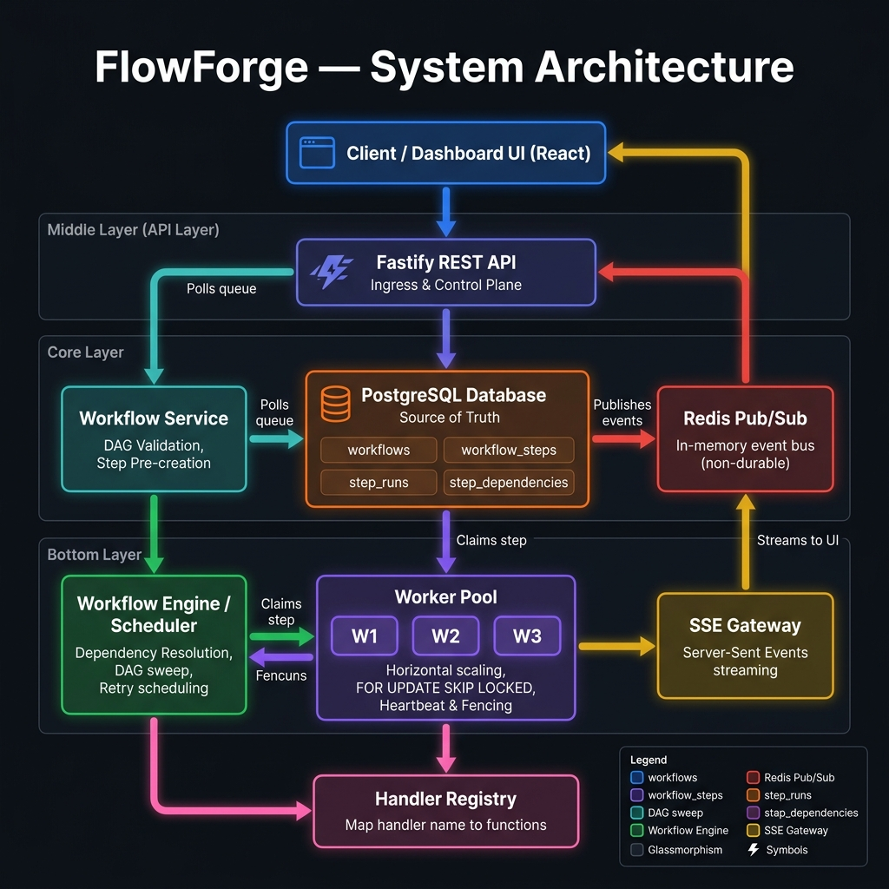
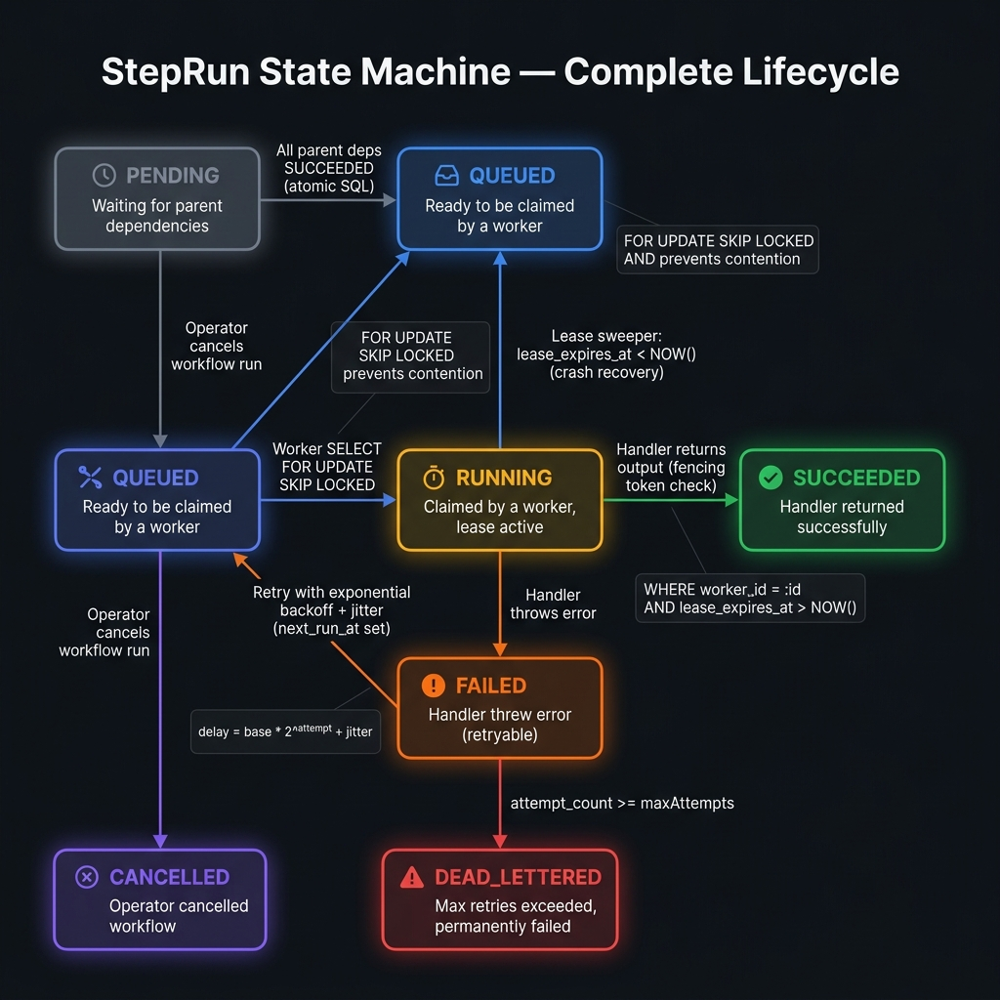
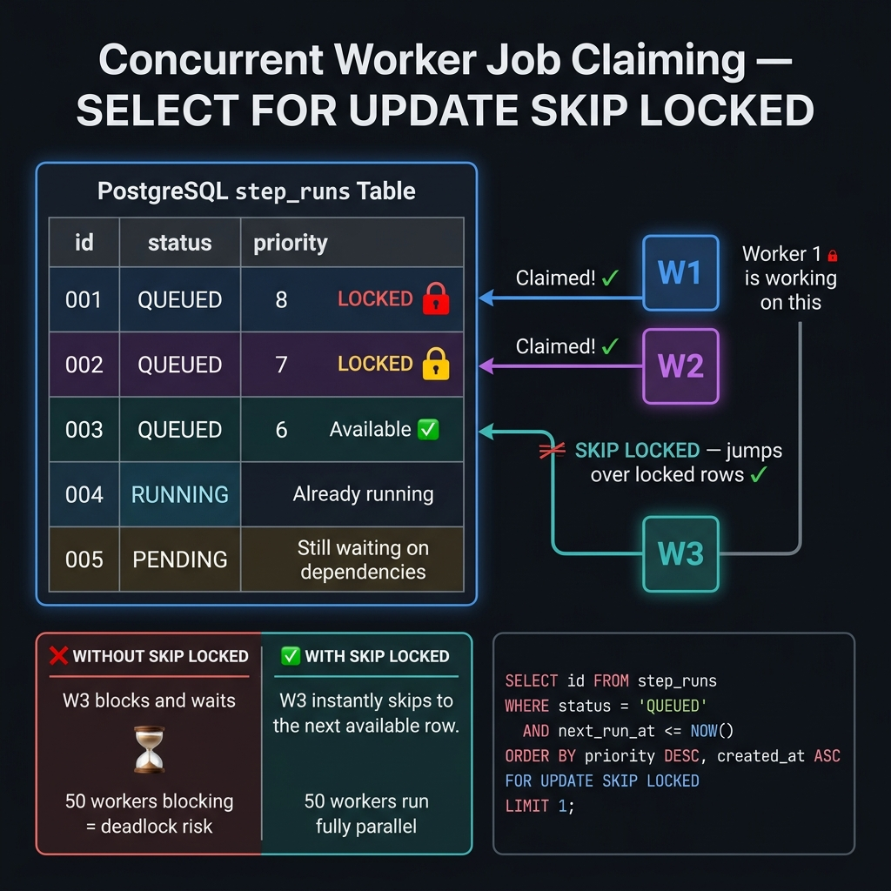
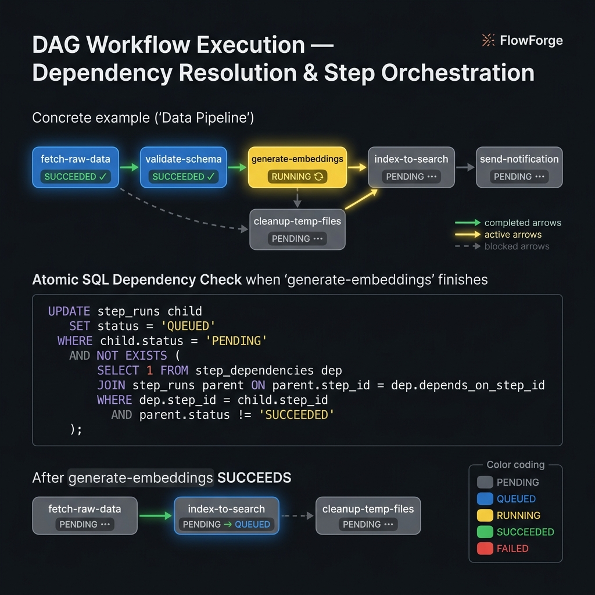
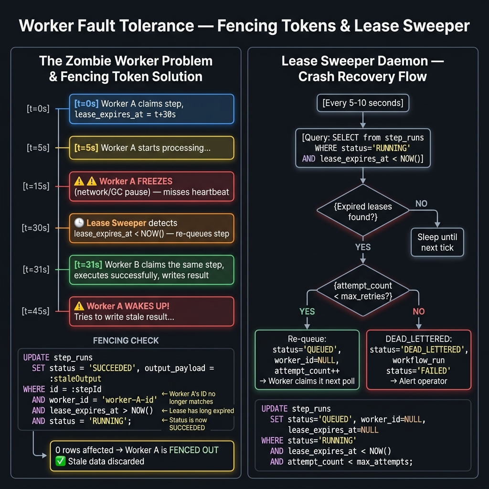
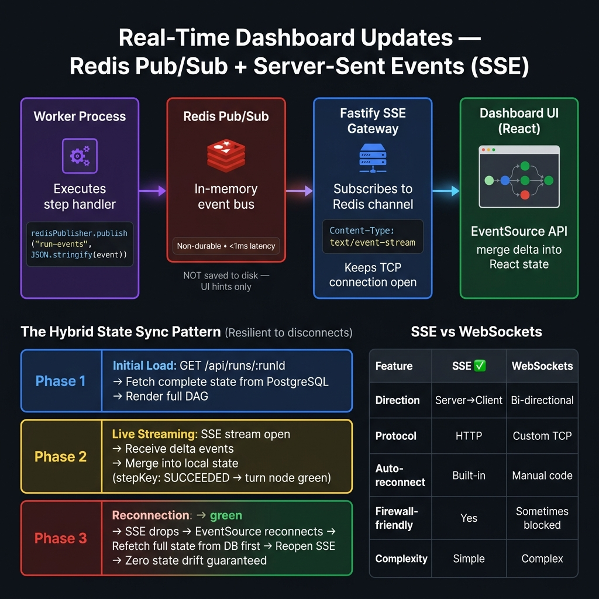
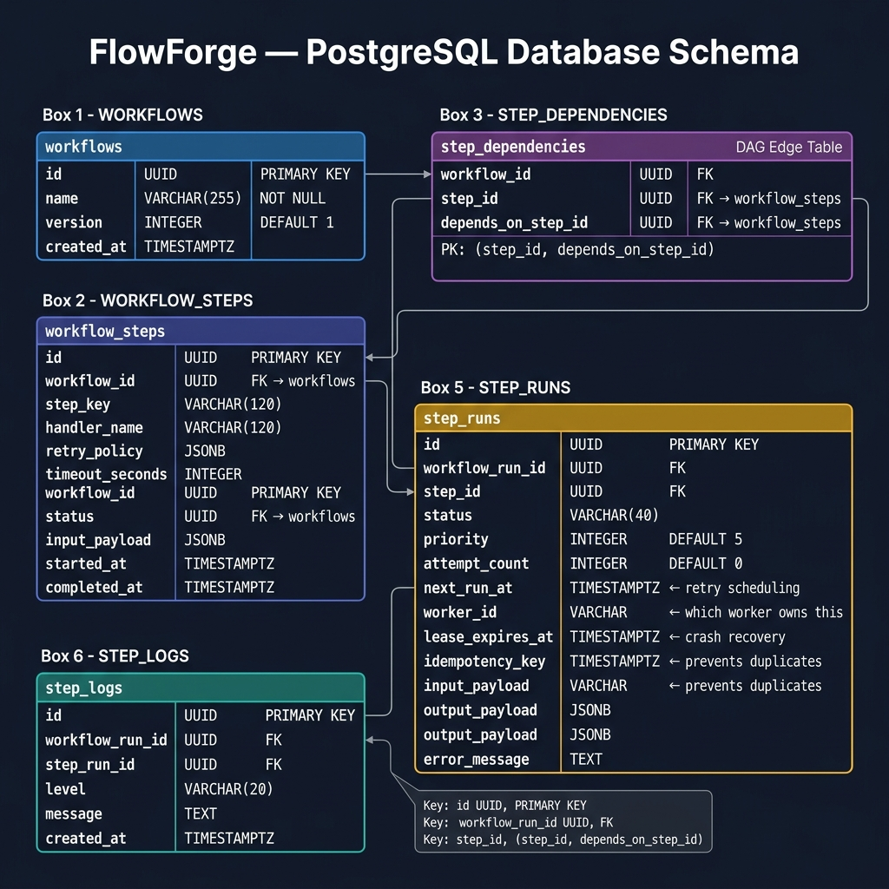

# FlowForge — Complete Beginner's System Design Guide

> **Who is this for?** This guide is written for SDE beginners (SDE-1 level) who want to deeply understand how FlowForge works — not just *what* it does, but *why* each design decision was made. Every diagram below is explained step by step.

---

## 📌 How to Read This Guide

Read the diagrams in order — each one builds on the previous:

| # | Diagram | What You'll Learn |
|---|---------|-------------------|
| 1 | [Architecture Overview](#1-high-level-architecture-overview) | How all components fit together |
| 2 | [StepRun State Machine](#2-steprun-state-machine) | How a single job moves through the system |
| 3 | [Worker Job Claiming](#3-concurrent-worker-job-claiming) | How workers safely grab jobs without conflicts |
| 4 | [DAG Execution](#4-dag-dependency-execution) | How step ordering is enforced automatically |
| 5 | [Fencing & Crash Recovery](#5-fencing-tokens--crash-recovery) | How the system survives worker crashes |
| 6 | [Real-Time SSE Streaming](#6-real-time-dashboard-updates) | How the dashboard stays live without page refreshes |
| 7 | [Database Schema](#7-postgresql-database-schema) | The exact tables powering everything |

---

## 1. High-Level Architecture Overview



### What Does This Show?

This is the **bird's-eye view** of FlowForge. There are 6 major layers, each with a clear responsibility:

| Layer | Component | Job |
|-------|-----------|-----|
| **User Layer** | Dashboard UI (React) | The operator sees workflow status here. Triggers runs. |
| **Ingress Layer** | Fastify REST API | Receives HTTP requests. Validates inputs. Routes to the right service. |
| **Service Layer** | Workflow Service | Handles the business logic: DAG validation, creating run records. |
| **State Layer** | PostgreSQL | **The single source of truth.** Everything is stored here durably. |
| **Event Layer** | Redis Pub/Sub | Lightweight real-time event bus for UI hints only (not durable!). |
| **Execution Layer** | Worker Pool | The actual job runners. Multiple workers run in parallel. |

### Key Insight for Beginners 🔑

> **Why PostgreSQL AND Redis?** PostgreSQL is reliable and durable — data never gets lost. But polling the database for every tiny UI update is wasteful. Redis is used as a fast "shortcut" to push live events to the browser. If Redis goes down, the dashboard just loads from PostgreSQL on refresh — no data is ever lost.

---

## 2. StepRun State Machine



### What Does This Show?

Every single job (called a `StepRun`) has a **status**. This diagram shows every possible status and how a StepRun moves between them.

### The 7 States — Explained Simply

| Status | Color | What It Means |
|--------|-------|---------------|
| `PENDING` | ⬜ Gray | "I'm waiting for my parent steps to finish first" |
| `QUEUED` | 🔵 Blue | "All my parents finished! I'm ready to be picked up by a worker" |
| `RUNNING` | 🟡 Yellow | "A worker has claimed me and is executing my handler code right now" |
| `SUCCEEDED` | 🟢 Green | "My handler finished successfully and returned output" |
| `FAILED` | 🟠 Orange | "My handler threw an error, but I still have retries left" |
| `DEAD_LETTERED` | 🔴 Red | "I failed too many times. Permanently stopped. Operator must intervene." |
| `CANCELLED` | 🟣 Purple | "An operator cancelled the whole workflow run before I could run" |

### The Critical Transitions

**PENDING → QUEUED**: This happens when all parent steps in the DAG have `SUCCEEDED`. The system checks this automatically using an atomic SQL query.

**QUEUED → RUNNING**: A worker grabs the job using `SELECT FOR UPDATE SKIP LOCKED`. This is the "safe claiming" mechanism.

**RUNNING → QUEUED** *(crash recovery)*: If a worker dies and its lease expires, the Lease Sweeper daemon re-queues the job so another worker can pick it up.

**FAILED → QUEUED** *(retry)*: The system calculates a delay using exponential backoff and schedules the next attempt using `next_run_at` field.

```
Retry Delay Formula:
delay = baseDelayMs × 2^(attempt - 1) + randomJitter

Example with baseDelayMs = 5000ms:
  Attempt 1 failed → wait 5s   + jitter
  Attempt 2 failed → wait 10s  + jitter  
  Attempt 3 failed → wait 20s  + jitter → DEAD_LETTERED if maxAttempts=3
```

---

## 3. Concurrent Worker Job Claiming



### What Does This Show?

This is one of the **most important technical concepts** in FlowForge. When 10 or 50 workers all poll the database at the same time looking for work, how do they avoid claiming the same job?

### The Problem Without SKIP LOCKED ❌

Imagine 50 workers all run:
```sql
SELECT id FROM step_runs WHERE status = 'QUEUED' LIMIT 1;
```
They all might see the same row! If Worker 1 and Worker 2 both find `job_001`, they'd both try to update it. This creates a **race condition** — data corruption.

The naive fix would be to wait for locks. But then Worker 2 blocks on Worker 1, and Worker 3 blocks on Worker 2... with 50 workers this becomes a **deadlock nightmare**.

### The Solution: `FOR UPDATE SKIP LOCKED` ✅

```sql
SELECT id FROM step_runs
WHERE status = 'QUEUED'
  AND next_run_at <= NOW()
ORDER BY priority DESC, created_at ASC
FOR UPDATE SKIP LOCKED   -- 👈 The magic ingredient
LIMIT 1;
```

What `SKIP LOCKED` does:
1. PostgreSQL tries to lock Row 001 for `Worker-1` → **Success**
2. `Worker-2` comes along, tries Row 001 → It's locked → **Instantly skips to Row 002**
3. `Worker-3` tries Row 001 → Skipped. Tries Row 002 → Skipped. **Claims Row 003 instantly**

**Result**: 50 workers can all query the same table simultaneously and each gets a unique job with **zero waiting**. This is $O(1)$ claiming complexity — it scales linearly!

---

## 4. DAG Dependency Execution



### What Does This Show?

A **Directed Acyclic Graph (DAG)** is the core of FlowForge. It defines *what order steps must run in* and *which steps can run in parallel*.

### Beginner Explanation: What is a DAG?

Think of it like a recipe:
- You can't put the cake in the oven before you mix the batter
- You can mix the frosting *at the same time* as baking (parallel!)
- You can't frost the cake until it's baked AND cooled (fan-in dependency)

In FlowForge, each step is a node, and arrows between nodes mean "must finish first".

### The Atomic Dependency Resolution SQL

When a step finishes, the system runs this query to automatically unlock all newly-ready steps:

```sql
UPDATE step_runs child
SET status = 'QUEUED',
    next_run_at = NOW()
WHERE child.workflow_run_id = :run_id
  AND child.status = 'PENDING'         -- Only look at waiting steps
  AND NOT EXISTS (
      -- Check: does this child have ANY parent that hasn't succeeded yet?
      SELECT 1
      FROM step_dependencies dep
      JOIN step_runs parent
        ON parent.step_id = dep.depends_on_step_id
       AND parent.workflow_run_id = child.workflow_run_id
      WHERE dep.step_id = child.step_id
        AND parent.status != 'SUCCEEDED'  -- If ANY parent isn't done, stay PENDING
  );
```

**Why this is clever**: Instead of loading data into the application and checking in code (which creates race conditions), the *database itself* decides which steps to unlock. Since databases process writes atomically, this is race-condition-proof.

### Why Pre-Create ALL Step Rows at Start?

**The "Concurrent Parents" Race Condition Problem**:
```
Step A ──\
          ──> Step C
Step B ──/
```
If Steps A and B finish at the *exact same millisecond* on separate workers:
- Worker 1 (running A) checks: "Is B done?" → Yes → Inserts Step C into queue
- Worker 2 (running B) checks: "Is A done?" → Yes → Also inserts Step C into queue
- **Result: Step C runs TWICE!** 💥

**The Fix**: At workflow start, ALL step rows are created upfront in one transaction. The database `UNIQUE(workflow_run_id, step_id)` constraint makes it physically impossible to insert a duplicate. The atomic SQL above just *transitions* existing rows from `PENDING` to `QUEUED` — no insertions happen at this stage.

---

## 5. Fencing Tokens & Crash Recovery



### What Does This Show?

Two related fault-tolerance mechanisms:
1. **Fencing Tokens** — protect against "zombie workers" writing stale data
2. **Lease Sweeper** — detects dead workers and re-queues their jobs

### The Zombie Worker Scenario 🧟

This is a real distributed systems problem. Here's how it plays out:

```
t=0s:  Worker A claims step_001, lease_expires_at = t+30s
t=5s:  Worker A starts processing a 20-second task
t=15s: Worker A's JVM freezes due to garbage collection
       Heartbeat misses → lease expires at t=30s
t=30s: Lease Sweeper detects expired lease → re-queues step_001
t=31s: Worker B claims step_001 → processes it → writes SUCCEEDED
t=45s: Worker A wakes up! It finished processing!
       Worker A tries: UPDATE step_runs SET status='SUCCEEDED'...
       ⚠️ WITHOUT GUARDS: Worker A OVERWRITES Worker B's result with stale data!
```

### The Fencing Token Solution ✅

Workers are **required** to include ownership verification in their commit query:

```sql
UPDATE step_runs
SET status = 'SUCCEEDED',
    output_payload = :output,
    completed_at = NOW()
WHERE id = :step_run_id
  AND worker_id = :worker_id          -- "I must still be the owner"
  AND lease_expires_at > NOW()        -- "My lease must still be valid"
  AND status = 'RUNNING';             -- "The step must still be in my possession"
```

When zombie Worker A runs this:
- `worker_id = 'worker-A'` — but the row now has `worker_id = 'worker-B'` → **NO MATCH**
- `lease_expires_at > NOW()` — Worker A's lease expired long ago → **NO MATCH**
- **Result: 0 rows updated** → Worker A detects this and **discards its stale output** 🛡️

### The Lease Sweeper Daemon

Runs every 5-10 seconds in the background:

```
Every 5s:
  1. Query: SELECT expired RUNNING jobs (lease_expires_at < NOW())
  2. For each expired job:
     - If attempt_count < max_retries → RE-QUEUE (status='QUEUED', worker_id=NULL)
     - If attempt_count >= max_retries → DEAD_LETTER (workflow fails, alert operator)
```

This guarantees **at-least-once execution**: even if a worker crashes mid-execution, the job will always be retried by another worker.

---

## 6. Real-Time Dashboard Updates



### What Does This Show?

How does the dashboard update live when a step changes status — without the user pressing refresh?

### The Pipeline: Worker → Redis → SSE → Browser

```
1. Worker finishes step
      ↓
2. Worker publishes to Redis:
   redisPublisher.publish("run-events", JSON.stringify({
     stepRunId: "abc-123",
     status: "SUCCEEDED",
     timestamp: new Date().toISOString()
   }))
      ↓
3. Redis broadcasts to all SSE Gateway subscribers (< 1ms)
      ↓
4. SSE Gateway writes to open HTTP connection:
   "event: status-update\ndata: {stepRunId: 'abc-123', status: 'SUCCEEDED'}\n\n"
      ↓
5. Browser EventSource receives event → React state update → Node turns green ✅
```

### Why Redis Pub/Sub (Not Kafka)?

Redis Pub/Sub is **fire-and-forget** — if no subscriber is connected when an event fires, the event is **lost**. This sounds bad, but it's actually fine here because:

- PostgreSQL is the real source of truth — no data is lost
- Redis events are just "UI hints" to avoid polling the DB constantly
- If the SSE connection drops, the dashboard re-fetches full state from PostgreSQL

### Why SSE Instead of WebSockets?

The dashboard only needs **one-way** communication (server → browser). It never needs to send real-time messages *up* to the server. SSE is the perfect fit:

| Feature | SSE ✅ (We Use This) | WebSockets |
|---------|---------------------|------------|
| Direction | Server → Client only | Bi-directional |
| Protocol | Standard HTTP | Custom TCP upgrade |
| Auto-reconnect | **Built into browsers** | Must code manually |
| Firewall-friendly | Works on port 80/443 | Sometimes blocked |
| Complexity | Very simple | Complex framing needed |

### The Hybrid State Sync Pattern

This pattern guarantees the dashboard never shows stale data, even if the SSE connection drops:

```
Step 1 — Initial Load:
  GET /api/runs/:runId → Full state from PostgreSQL → Render complete DAG

Step 2 — Live Stream:
  GET /api/events/stream → SSE connection opens → Merge delta events into UI

Step 3 — Reconnection (e.g. laptop closes and reopens):
  SSE drops → EventSource auto-reconnects → 
  But FIRST: GET /api/runs/:runId (refetch full state) →
  THEN: Reopen SSE stream → Zero state drift ✅
```

---

## 7. PostgreSQL Database Schema



### What Does This Show?

The exact database tables that store all FlowForge state. PostgreSQL is the **single source of truth** — every other component (Redis, SSE) can be destroyed and rebuilt from these tables.

### Table Relationships

```
workflows (template)
    │
    ├──> workflow_steps (step definitions inside the template)
    │         │
    │         └──> step_dependencies (DAG edges: "A must run before B")
    │
    └──> workflow_runs (one execution instance of the template)
              │
              ├──> step_runs (one execution of each step, the job queue)
              │
              └──> step_logs (log lines emitted during execution)
```

### Key Fields to Understand in `step_runs`

This is the most important table — it acts as the **job queue, state machine, and execution log** all in one:

| Field | Why It Exists |
|-------|---------------|
| `status` | The current state: PENDING / QUEUED / RUNNING / SUCCEEDED / FAILED / DEAD_LETTERED |
| `next_run_at` | When a retry should run. Workers only claim rows where `next_run_at <= NOW()` |
| `worker_id` | Which worker currently owns this job. Used in fencing token check. |
| `lease_expires_at` | The deadline for the worker to finish (or keep renewing via heartbeat) |
| `attempt_count` | How many times this step has been attempted. Controls retry limit. |
| `idempotency_key` | Unique key per attempt. Handlers check this before doing side effects. |
| `priority` | Higher priority steps get claimed first (ORDER BY priority DESC) |

### Critical Indexes

These indexes are what make FlowForge fast under load:

```sql
-- Index 1: Worker Polling (used thousands of times per minute)
CREATE INDEX idx_step_runs_claim
ON step_runs(status, next_run_at, priority DESC, created_at);
-- Allows workers to instantly find QUEUED jobs ready to run, in priority order

-- Index 2: Lease Sweeper (used every 5-10 seconds)
CREATE INDEX idx_step_runs_lease
ON step_runs(status, lease_expires_at);
-- Allows sweeper to instantly find RUNNING jobs with expired leases

-- Index 3: Dashboard Queries (used every page load)
CREATE INDEX idx_step_runs_workflow_run
ON step_runs(workflow_run_id);
-- Allows fast lookup of all steps for a specific workflow run
```

---

## 🗺️ End-to-End Execution: Putting It All Together

Here's what happens when you call `POST /api/workflows/my-pipeline/runs`:

```
1. API receives request
   ↓
2. Workflow Service fetches workflow definition from PostgreSQL
   ↓
3. DAG Validator runs DFS cycle detection — rejects if circular dependency found
   ↓
4. Atomic transaction:
   - INSERT workflow_runs row (status = RUNNING)
   - INSERT step_runs rows for ALL steps
     → Root steps (no dependencies): status = QUEUED
     → Other steps: status = PENDING
   ↓
5. API returns 202 Accepted + workflowRunId
   ↓
6. Workers are polling the database...
   Worker 1: SELECT FOR UPDATE SKIP LOCKED → Claims root step
   Worker 2: SELECT FOR UPDATE SKIP LOCKED → Claims other root step (if any)
   ↓
7. Each worker:
   - Loads handler from Handler Registry
   - Executes handler with input payload + idempotency key
   - Sends heartbeats every 10s (extends lease_expires_at)
   - On success: UPDATE with fencing token check
   - On failure: Calculate backoff, set next_run_at, increment attempt_count
   ↓
8. After each step success:
   - Engine runs atomic dependency SQL
   - Newly-ready downstream steps transition PENDING → QUEUED
   - Workers pick them up on next poll
   ↓
9. After every state change:
   - Worker publishes event to Redis Pub/Sub
   - SSE Gateway forwards to open browser connections
   - Dashboard updates live
   ↓
10. When all steps succeed:
    - workflow_runs.status → SUCCEEDED
    - Dashboard shows green ✅
```

---

## 🎯 Interview Cheat Sheet

When asked about FlowForge in a technical interview, lead with these:

| Question | Your Answer |
|----------|-------------|
| "How do you prevent two workers from claiming the same job?" | `SELECT FOR UPDATE SKIP LOCKED` — atomically locks and skips |
| "What if a worker crashes mid-execution?" | Lease mechanism + Sweeper daemon re-queues after lease expires |
| "How do you prevent zombie workers from corrupting data?" | Fencing token: commit query includes `WHERE worker_id = :id AND lease_expires_at > NOW()` |
| "How do you prevent a step from running twice when two parents finish simultaneously?" | Pre-create all step rows at start with UNIQUE constraint; atomic SQL transitions PENDING→QUEUED |
| "Why PostgreSQL instead of Kafka for the queue?" | ACID transactions, simpler ops, no dual state consistency problem, SKIP LOCKED is sufficient at this scale |
| "What is at-least-once execution?" | Jobs may run more than once (after crash + re-queue). Handlers must be idempotent using `idempotency_key` |
| "Why SSE instead of WebSockets?" | Dashboard is read-only; SSE is simpler, has built-in browser reconnect, works through firewalls |

---

## 📁 Related Files

- [System Design Document](../flowforge_system_design.md) — Full technical specification
- [Product Requirements](../flowforge_prd.md) — Feature requirements and priorities
- [API Service Deep-Dive](services/api_service.md) — DAG validation and endpoint contracts
- [Worker System Deep-Dive](services/worker_system.md) — Polling, fencing, idempotency
- [Scheduler Engine Deep-Dive](services/scheduler_engine.md) — Dependency resolution, lease sweeper
- [Real-Time Service Deep-Dive](services/realtime_update_service.md) — Redis, SSE, hybrid sync
