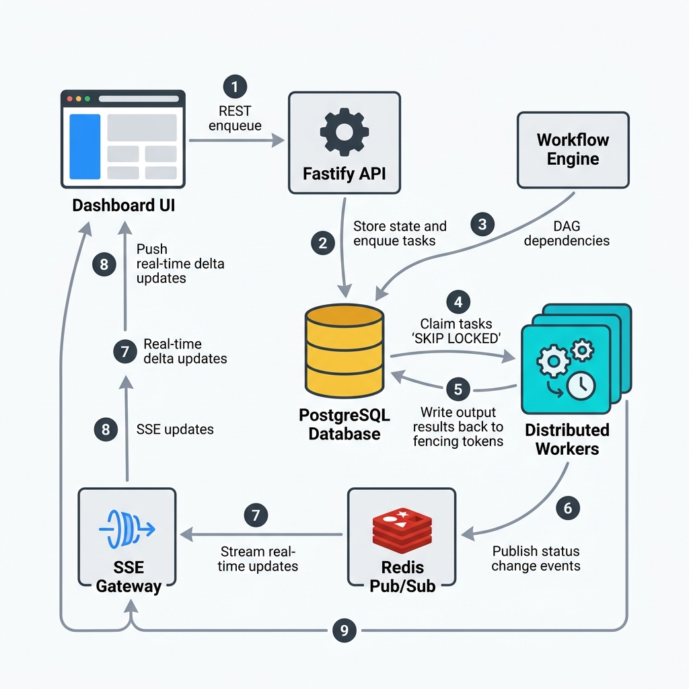

# FlowForge — Complete Beginner's System Design Guide

> **Who is this for?** This guide is written for SDE beginners (SDE-1 level) who want to deeply understand how FlowForge works — not just *what* it does, but *why* each design decision was made. Every diagram below is explained step by step.

---

## 📌 How to Read This Guide

Read the diagrams in order — each one builds on the previous:

| # | Diagram | What You'll Learn |
|---|---------|-------------------|
| 1 | [Architecture Overview](#1-high-level-architecture-overview) | How all components fit together |
| 2 | [StepRun State Machine](#2-steprun-state-machine) | How a single job moves through the system |
| 3 | [Worker Job Claiming](#3-concurrent-worker-job-claiming) | How workers safely grab jobs without conflicts |
| 4 | [DAG Execution](#4-dag-dependency-execution) | How step ordering is enforced automatically |
| 5 | [Fencing & Crash Recovery](#5-fencing-tokens--crash-recovery) | How the system survives worker crashes |
| 6 | [Real-Time SSE Streaming](#6-real-time-dashboard-updates) | How the dashboard stays live without page refreshes |
| 7 | [Database Schema](#7-postgresql-database-schema) | The exact tables powering everything |

---

## 1. High-Level Architecture Overview



### What Does This Show?

This is the **bird's-eye view** of FlowForge. There are 6 major layers, each with a clear responsibility:

| Layer | Component | Job |
|-------|-----------|-----|
| **User Layer** | Dashboard UI (React) | The operator sees workflow status here. Triggers runs. |
| **Ingress Layer** | Fastify REST API | Receives HTTP requests. Validates inputs. Routes to the right service. |
| **Service Layer** | Workflow Service | Handles the business logic: DAG validation, creating run records. |
| **State Layer** | PostgreSQL | **The single source of truth.** Everything is stored here durably. |
| **Event Layer** | Redis Pub/Sub | Lightweight real-time event bus for UI hints only (not durable!). |
| **Execution Layer** | Worker Pool | The actual job runners. Multiple workers run in parallel. |

### Key Insight for Beginners 🔑

> **Why PostgreSQL AND Redis?** PostgreSQL is reliable and durable — data never gets lost. But polling the database for every tiny UI update is wasteful. Redis is used as a fast "shortcut" to push live events to the browser. If Redis goes down, the dashboard just loads from PostgreSQL on refresh — no data is ever lost.

---

## 2. StepRun State Machine


### What Does This Show?

Every single job (called a `StepRun`) has a **status**. This diagram shows every possible status and how a StepRun moves between them.

### The 8 States — Explained Simply

| Status | Color | What It Means |
|--------|-------|---------------|
| `PENDING` | ⬜ Gray | "I'm waiting for my parent steps to finish first" |
| `QUEUED` | 🔵 Blue | "All my parents finished! I'm ready to be picked up by a worker" |
| `RUNNING` | 🟡 Yellow | "A worker has claimed me and is executing my handler code right now" |
| `SUCCEEDED` | 🟢 Green | "My handler finished successfully and returned output" |
| `RETRYING` | 🟠 Orange | "My handler threw an error, but I still have retries left — I'm waiting for my backoff delay" |
| `DEAD_LETTERED` | 🔴 Red | "I failed too many times. Permanently stopped. Operator must intervene." |
| `CANCELLED` | 🟣 Purple | "An operator cancelled the whole workflow run before I could run" |

> **Note:** There is no generic `FAILED` status on `step_runs`. When a step errors and has retries remaining, it transitions to `RETRYING` (not `FAILED`). `DEAD_LETTERED` is the final failure state. The **workflow run itself** transitions to `FAILED` when a step is dead-lettered.

### The Critical Transitions

**PENDING → QUEUED**: This happens when all parent steps in the DAG have `SUCCEEDED`. The system checks this automatically using an atomic SQL query inside `promoteDownstreamSteps()`.

**QUEUED → RUNNING**: A worker grabs the job using `SELECT FOR UPDATE SKIP LOCKED`. This is the "safe claiming" mechanism. The `attempt_count` is incremented at this point.

**RUNNING → RETRYING** *(retry)*: When a step handler throws an error and `attempt_count < max_attempts`, the worker sets status to `RETRYING` and calculates a backoff delay stored in `next_run_at`.

**RETRYING → QUEUED** *(retry scheduler)*: The `@flowforge/scheduler` retry scheduler (default: every 5 s) polls for `RETRYING` rows where `next_run_at <= NOW()` and transitions them back to `QUEUED`, making them claimable again.

**RUNNING → QUEUED** *(crash recovery)*: If a worker dies and its lease expires, the Lease Sweeper daemon re-queues the job so another worker can pick it up.

**RUNNING → DEAD_LETTERED** *(exhausted)*: When `attempt_count >= max_attempts` on failure, the step is dead-lettered and the parent `workflow_run` is transitioned to `FAILED`.

```
Retry Delay Formula:
delay = baseDelayMs × 2^(attempt - 1) + randomJitter(0..baseDelayMs)

Example with baseDelayMs = 1000ms (default):
  Attempt 1 failed → wait ~1s  + jitter  → status: RETRYING
  Attempt 2 failed → wait ~2s  + jitter  → status: RETRYING
  Attempt 3 failed (attempt_count >= max_attempts=3) → DEAD_LETTERED
```

---

## 3. Concurrent Worker Job Claiming


### What Does This Show?

This is one of the **most important technical concepts** in FlowForge. When 10 or 50 workers all poll the database at the same time looking for work, how do they avoid claiming the same job?

### The Problem Without SKIP LOCKED ❌

Imagine 50 workers all run:
```sql
SELECT id FROM step_runs WHERE status = 'QUEUED' LIMIT 1;
```
They all might see the same row! If Worker 1 and Worker 2 both find `job_001`, they'd both try to update it. This creates a **race condition** — data corruption.

The naive fix would be to wait for locks. But then Worker 2 blocks on Worker 1, and Worker 3 blocks on Worker 2... with 50 workers this becomes a **deadlock nightmare**.

### The Solution: `FOR UPDATE SKIP LOCKED` ✅

This is the exact query used in `packages/queue/src/claim.ts`:

```sql
-- Phase 1: Claim the row (inside a transaction)
SELECT id, workflow_run_id, step_id, input_payload, attempt_count,
       max_attempts, idempotency_key, priority
FROM step_runs
WHERE status = 'QUEUED'
  AND next_run_at <= NOW()
ORDER BY priority DESC, next_run_at ASC, created_at ASC
LIMIT 1
FOR UPDATE SKIP LOCKED;

-- Phase 2: Mark it RUNNING in the same transaction
UPDATE step_runs
SET
  status           = 'RUNNING',
  worker_id        = $workerId,
  lease_expires_at = NOW() + ($leaseDurationSeconds * INTERVAL '1 second'),
  attempt_count    = attempt_count + 1,
  started_at       = NOW()
WHERE id = $claimedId
RETURNING *;
```

What `SKIP LOCKED` does:
1. PostgreSQL tries to lock Row 001 for `Worker-1` → **Success**
2. `Worker-2` comes along, tries Row 001 → It's locked → **Instantly skips to Row 002**
3. `Worker-3` tries Row 001 → Skipped. Tries Row 002 → Skipped. **Claims Row 003 instantly**

**Result**: 50 workers can all query the same table simultaneously and each gets a unique job with **zero waiting**. This is O(1) claiming complexity — it scales linearly!

> **Key Detail**: Both the SELECT and the UPDATE happen inside the **same database transaction**. The lock is held between them so no other worker can claim the same row in between. The transaction commits only after the UPDATE succeeds.

---

## 4. DAG Dependency Execution


### What Does This Show?

A **Directed Acyclic Graph (DAG)** is the core of FlowForge. It defines *what order steps must run in* and *which steps can run in parallel*.

### Beginner Explanation: What is a DAG?

Think of it like a recipe:
- You can't put the cake in the oven before you mix the batter
- You can mix the frosting *at the same time* as baking (parallel!)
- You can't frost the cake until it's baked AND cooled (fan-in dependency)

In FlowForge, each step is a node, and arrows between nodes mean "must finish first".

### The Atomic Dependency Resolution SQL

When a step finishes, `promoteDownstreamSteps()` in `packages/queue/src/promote.ts` runs this query to automatically unlock all newly-ready steps:

```sql
UPDATE step_runs
SET status = 'QUEUED', next_run_at = NOW()
WHERE workflow_run_id = $workflowRunId
  AND status = 'PENDING'
  AND id IN (
    -- Find steps whose ALL dependencies are now SUCCEEDED
    SELECT sr.id
    FROM step_runs sr
    JOIN step_dependencies sd ON sd.step_id = sr.step_id
    GROUP BY sr.id
    HAVING COUNT(*) FILTER (
      WHERE EXISTS (
        SELECT 1 FROM step_runs dep
        WHERE dep.step_id = sd.depends_on_step_id
          AND dep.workflow_run_id = $workflowRunId
          AND dep.status = 'SUCCEEDED'
      )
    ) = COUNT(*)
  )
RETURNING id;
```

**Why this is clever**: The `HAVING COUNT(*) FILTER(...) = COUNT(*)` pattern means "every dependency must have a matching SUCCEEDED row". If any parent is still PENDING/RUNNING/RETRYING, the child stays PENDING. Since databases process writes atomically, this is race-condition-proof.

### Why Pre-Create ALL Step Rows at Start?

**The "Concurrent Parents" Race Condition Problem**:
```
Step A ──\
          ──> Step C
Step B ──/
```
If Steps A and B finish at the *exact same millisecond* on separate workers:
- Worker 1 (running A) checks: "Is B done?" → Yes → Inserts Step C into queue
- Worker 2 (running B) checks: "Is A done?" → Yes → Also inserts Step C into queue
- **Result: Step C runs TWICE!** 💥

**The Fix**: At workflow start, ALL step rows are created upfront in one transaction (all with `status = 'PENDING'`). Root steps (those with no dependencies) are immediately updated to `status = 'QUEUED'`. The database `UNIQUE (workflow_run_id, step_id)` constraint makes it physically impossible to insert a duplicate. The atomic SQL above just *transitions* existing rows from `PENDING` to `QUEUED` — no insertions happen at this stage.

### The `workflow_run` Lifecycle During Creation

Inside `createWorkflowRun()` in `packages/engine/src/run-creator.ts`, the exact sequence is:

```
1. INSERT workflow_runs row  → status = 'PENDING'
2. Pre-create ALL step_runs  → status = 'PENDING' for every step
3. UPDATE workflow_runs      → status = 'RUNNING', started_at = NOW()
4. UPDATE root step_runs     → status = 'QUEUED', next_run_at = NOW()
5. COMMIT the whole transaction
```

> **Important**: The `workflow_run` starts as `PENDING`, not `RUNNING`. It only becomes `RUNNING` after all step rows are safely created. When all steps complete, it transitions to `COMPLETED` (not `SUCCEEDED`).

---

## 5. Fencing Tokens & Crash Recovery


### What Does This Show?

Two related fault-tolerance mechanisms:
1. **Fencing Tokens** — protect against "zombie workers" writing stale data
2. **Lease Sweeper** — detects dead workers and re-queues their jobs

### The Zombie Worker Scenario 🧟

This is a real distributed systems problem. Here's how it plays out:

```
t=0s:  Worker A claims step_001, lease_expires_at = t+30s
t=5s:  Worker A starts processing a 20-second task
t=15s: Worker A's process freezes (GC pause, network issue, etc.)
       Heartbeat misses → lease expires at t=30s
t=30s: Lease Sweeper detects expired lease → re-queues step_001
t=31s: Worker B claims step_001 → processes it → writes SUCCEEDED
t=45s: Worker A wakes up! It finished processing!
       Worker A tries: UPDATE step_runs SET status='SUCCEEDED'...
       ⚠️ WITHOUT GUARDS: Worker A OVERWRITES Worker B's result with stale data!
```

### The Fencing Token Solution ✅

Workers are **required** to include ownership verification in their commit query (see `packages/queue/src/commit.ts`):

```sql
UPDATE step_runs
SET
  status           = 'SUCCEEDED',
  output_payload   = $outputPayload,
  completed_at     = NOW(),
  worker_id        = NULL,
  lease_expires_at = NULL
WHERE id = $stepRunId
  AND worker_id        = $workerId        -- "I must still be the owner"
  AND status           = 'RUNNING'        -- "The step must still be mine"
  AND lease_expires_at > NOW();           -- "My lease must still be valid"
```

When zombie Worker A runs this:
- `worker_id = 'worker-A'` — but the row now has `worker_id = 'worker-B'` → **NO MATCH**
- `lease_expires_at > NOW()` — Worker A's lease expired long ago → **NO MATCH**
- **Result: 0 rows updated** → Worker A detects `rowCount === 0` and **discards its stale output** 🛡️

The same three-condition guard applies to `commitStepFailure()` — if the lease was lost, the failure commit is also rejected (`return 0` fencing miss).

### The Heartbeat — Keeping the Lease Alive

Workers run a `setInterval` heartbeat (see `packages/worker/src/lease-heartbeat.ts`) that periodically extends the lease:

```typescript
// Runs every heartbeatIntervalMs while the step is executing
const rows = await refreshLease(pool, stepRunId, workerId, leaseDurationSeconds);
if (rows === 0) {
  // We lost our lease — abort the handler immediately
  abortController.abort(new Error('Lease lost during heartbeat'));
}
```

The heartbeat sends an `AbortSignal` to the handler if the lease refresh returns 0 rows, allowing long-running handlers to stop cleanly.

### The Lease Sweeper Daemon

The `@flowforge/scheduler` package runs two background timers (see `packages/scheduler/src/index.ts`):

| Timer | Default Interval | What It Does |
|-------|-----------------|--------------|
| **Retry Scheduler** | Every 5 s (`SCHEDULER_POLL_INTERVAL_MS`) | Promotes `RETRYING` rows with `next_run_at <= NOW()` back to `QUEUED` |
| **Lease Sweeper** | Every 15 s (`SWEEPER_POLL_INTERVAL_MS`) | Handles expired `RUNNING` leases |

The sweeper logic (from `packages/queue/src/sweeper.ts`):

```
Every 15s:
  Query 1: step_runs WHERE status='RUNNING' AND lease_expires_at < NOW()
           AND attempt_count < max_attempts
    → SET status='QUEUED', worker_id=NULL, lease_expires_at=NULL, next_run_at=NOW()

  Query 2: step_runs WHERE status='RUNNING' AND lease_expires_at < NOW()
           AND attempt_count >= max_attempts
    → SET status='DEAD_LETTERED'
    → UPDATE workflow_runs SET status='FAILED' for each dead-lettered run
```

This guarantees **at-least-once execution**: even if a worker crashes mid-execution, the job will always be retried by another worker (unless attempts are exhausted).

---

## 6. Real-Time Dashboard Updates


### What Does This Show?

How does the dashboard update live when a step changes status — without the user pressing refresh?

### The Pipeline: Worker → Redis → SSE → Browser

The actual Redis channels used (from `packages/events/src/channels.ts`):

| Channel | Purpose |
|---------|---------|
| `flowforge:events:run:<runId>` | Per-run events — subscribed when viewing a specific run |
| `flowforge:events:global` | All events — subscribed by the global dashboard view |

```
1. Worker finishes step
      ↓
2. Worker publishes to Redis via publishStepEvent():
   publisher.publish('flowforge:events:run:<runId>', JSON.stringify(event))
   publisher.publish('flowforge:events:global', JSON.stringify(event))
   // Fire-and-forget — never throws. Dashboard recovers via REST if Redis is down.
      ↓
3. Redis broadcasts to all SSE Gateway subscribers (< 1ms)
      ↓
4. SSE Gateway (GET /api/events/stream) writes to open HTTP connection:
   "event: <event.type>\ndata: <JSON>\n\n"
      ↓
5. Browser EventSource receives event → React state update → Node turns green ✅
```

The SSE endpoint (`packages/api/src/routes/events/stream.ts`) also sends a keep-alive `: ping` comment every 30 seconds to prevent proxy timeouts.

### Why Redis Pub/Sub (Not Kafka)?

Redis Pub/Sub is **fire-and-forget** — if no subscriber is connected when an event fires, the event is **lost**. This sounds bad, but it's actually fine here because:

- PostgreSQL is the real source of truth — no data is lost
- Redis events are just "UI hints" to avoid polling the DB constantly
- If the SSE connection drops, the dashboard re-fetches full state from PostgreSQL

### Why SSE Instead of WebSockets?

The dashboard only needs **one-way** communication (server → browser). It never needs to send real-time messages *up* to the server. SSE is the perfect fit:

| Feature | SSE ✅ (We Use This) | WebSockets |
|---------|---------------------|------------|
| Direction | Server → Client only | Bi-directional |
| Protocol | Standard HTTP | Custom TCP upgrade |
| Auto-reconnect | **Built into browsers** | Must code manually |
| Firewall-friendly | Works on port 80/443 | Sometimes blocked |
| Complexity | Very simple | Complex framing needed |

### The Hybrid State Sync Pattern

This pattern guarantees the dashboard never shows stale data, even if the SSE connection drops:

```
Step 1 — Initial Load:
  GET /api/runs/:runId → Full state from PostgreSQL → Render complete DAG

Step 2 — Live Stream:
  GET /api/events/stream?runId=<id> → SSE connection opens → Merge delta events into UI

Step 3 — Reconnection (e.g. laptop closes and reopens):
  SSE drops → EventSource auto-reconnects →
  But FIRST: GET /api/runs/:runId (refetch full state) →
  THEN: Reopen SSE stream → Zero state drift ✅
```

---

## 7. PostgreSQL Database Schema


### What Does This Show?

The exact database tables that store all FlowForge state. PostgreSQL is the **single source of truth** — every other component (Redis, SSE) can be destroyed and rebuilt from these tables.

### Table Relationships

```
workflows (template)
    │
    ├──> workflow_steps (step definitions inside the template)
    │         │
    │         └──> step_dependencies (DAG edges: "A must run before B")
    │
    └──> workflow_runs (one execution instance of the template)
              │
              └──> step_runs (one execution of each step — the job queue)
                        │
                        └──> step_logs (log lines emitted during execution)

connection_refs  (encrypted external connection credentials — standalone table)
audit_logs       (actor action trail — standalone table)
```

### All Tables — Exact Schema

#### `workflows`
```sql
id            UUID PRIMARY KEY DEFAULT gen_random_uuid()
name          TEXT NOT NULL
description   TEXT                          -- optional free-text description
version       INTEGER NOT NULL DEFAULT 1
created_by    TEXT NOT NULL                 -- Clerk user ID of the creator
created_at    TIMESTAMPTZ NOT NULL DEFAULT NOW()
updated_at    TIMESTAMPTZ NOT NULL DEFAULT NOW()
```

#### `workflow_steps`
```sql
id              UUID PRIMARY KEY DEFAULT gen_random_uuid()
workflow_id     UUID NOT NULL REFERENCES workflows(id) ON DELETE CASCADE
step_key        TEXT NOT NULL               -- unique human label within a workflow
handler_name    TEXT NOT NULL               -- matches a key in the handler registry
input_config    JSONB NOT NULL DEFAULT '{}'  -- static inputs for this step
retry_policy    JSONB NOT NULL DEFAULT '{"maxAttempts":3,"baseDelayMs":1000}'
timeout_seconds INTEGER NOT NULL DEFAULT 300
created_at      TIMESTAMPTZ NOT NULL DEFAULT NOW()
UNIQUE (workflow_id, step_key)
```

#### `step_dependencies`
```sql
workflow_id        UUID NOT NULL REFERENCES workflows(id)
step_id            UUID NOT NULL REFERENCES workflow_steps(id)
depends_on_step_id UUID NOT NULL REFERENCES workflow_steps(id)
PRIMARY KEY (step_id, depends_on_step_id)
```

#### `workflow_runs`
```sql
id              UUID PRIMARY KEY DEFAULT gen_random_uuid()
workflow_id     UUID NOT NULL REFERENCES workflows(id)
status          TEXT NOT NULL DEFAULT 'PENDING'  -- PENDING | RUNNING | COMPLETED | FAILED | CANCELLED
input_payload   JSONB NOT NULL DEFAULT '{}'
original_run_id UUID REFERENCES workflow_runs(id)  -- non-null for replays
triggered_by    TEXT NOT NULL                        -- Clerk user ID who triggered this run
started_at      TIMESTAMPTZ
completed_at    TIMESTAMPTZ
created_at      TIMESTAMPTZ NOT NULL DEFAULT NOW()
```

> **Key**: `workflow_runs.status` terminal states are `COMPLETED` (all steps succeeded) and `FAILED` (a step was dead-lettered). There is no `SUCCEEDED` status on `workflow_runs`.

#### `step_runs`
```sql
id               UUID PRIMARY KEY DEFAULT gen_random_uuid()
workflow_run_id  UUID NOT NULL REFERENCES workflow_runs(id) ON DELETE CASCADE
step_id          UUID NOT NULL REFERENCES workflow_steps(id)
status           TEXT NOT NULL DEFAULT 'PENDING'
  -- PENDING | QUEUED | RUNNING | SUCCEEDED | RETRYING | DEAD_LETTERED | CANCELLED
attempt_count    INTEGER NOT NULL DEFAULT 0
max_attempts     INTEGER NOT NULL DEFAULT 3   -- copied from retry_policy at creation
idempotency_key  TEXT NOT NULL                -- unique per step_run; format: <runId>:<stepId>
input_payload    JSONB NOT NULL DEFAULT '{}'
output_payload   JSONB
error_message    TEXT
worker_id        TEXT                         -- which worker currently owns this
lease_expires_at TIMESTAMPTZ                  -- deadline for the worker to complete or heartbeat
next_run_at      TIMESTAMPTZ NOT NULL DEFAULT NOW()  -- earliest time workers can claim (used for retries)
priority         INTEGER NOT NULL DEFAULT 0   -- higher = claimed first
started_at       TIMESTAMPTZ
completed_at     TIMESTAMPTZ
created_at       TIMESTAMPTZ NOT NULL DEFAULT NOW()
UNIQUE (workflow_run_id, step_id)
```

#### `step_logs`
```sql
id          UUID PRIMARY KEY DEFAULT gen_random_uuid()
step_run_id UUID NOT NULL REFERENCES step_runs(id) ON DELETE CASCADE
level       TEXT NOT NULL       -- DEBUG | INFO | WARN | ERROR
message     TEXT NOT NULL
metadata    JSONB NOT NULL DEFAULT '{}'
created_at  TIMESTAMPTZ NOT NULL DEFAULT NOW()
```

> **Note**: `step_logs` links directly to `step_runs` via `step_run_id` — there is no `workflow_run_id` column in this table. To query all logs for a run, join through `step_runs`.

#### `connection_refs` *(standalone — not linked to workflows)*
```sql
id                UUID PRIMARY KEY DEFAULT gen_random_uuid()
name              TEXT NOT NULL UNIQUE        -- e.g. "postgres-warehouse"
type              TEXT NOT NULL               -- e.g. "postgres" | "smtp" | "blob"
encrypted_config  BYTEA NOT NULL              -- AES-256-GCM encrypted JSON
created_by        TEXT NOT NULL               -- Clerk user ID
created_at        TIMESTAMPTZ NOT NULL DEFAULT NOW()
updated_at        TIMESTAMPTZ NOT NULL DEFAULT NOW()
```

#### `audit_logs` *(standalone — append-only audit trail)*
```sql
id          UUID PRIMARY KEY DEFAULT gen_random_uuid()
actor_id    TEXT NOT NULL       -- Clerk user ID
action      TEXT NOT NULL       -- e.g. "workflow.create", "run.trigger", "run.cancel"
resource_id TEXT                -- the affected resource UUID (nullable for global actions)
metadata    JSONB NOT NULL DEFAULT '{}'
created_at  TIMESTAMPTZ NOT NULL DEFAULT NOW()
```

### Key Fields to Understand in `step_runs`

This is the most important table — it acts as the **job queue, state machine, and execution log** all in one:

| Field | Why It Exists |
|-------|---------------|
| `status` | Current state: PENDING / QUEUED / RUNNING / SUCCEEDED / RETRYING / DEAD_LETTERED / CANCELLED |
| `next_run_at` | Earliest time a worker can claim this row. Set to future time during `RETRYING`. Workers only claim rows where `next_run_at <= NOW()`. |
| `worker_id` | Which worker currently owns this job. Used in fencing token check. Cleared to `NULL` on success or lease expiry. |
| `lease_expires_at` | The deadline for the worker to finish (or keep renewing via heartbeat). Cleared to `NULL` on success. |
| `attempt_count` | Incremented at claim time (not at failure time). Read by workers after claiming. |
| `max_attempts` | Upper limit for `attempt_count`. Stored on the row so sweeper doesn't need to join `workflow_steps`. |
| `idempotency_key` | Unique key per step run attempt. Handlers check this before doing side effects. |
| `priority` | Higher priority steps get claimed first (`ORDER BY priority DESC`) |

### Critical Indexes

These indexes are what make FlowForge fast under load:

```sql
-- Index 1: Worker Polling (used thousands of times per minute)
CREATE INDEX idx_step_runs_claim
  ON step_runs(status, next_run_at, priority DESC, created_at);
-- Covers: WHERE status='QUEUED' AND next_run_at<=NOW()  ORDER BY priority DESC, next_run_at ASC, created_at ASC

-- Index 2: Lease Sweeper (runs every 15 seconds by default)
CREATE INDEX idx_step_runs_lease
  ON step_runs(status, lease_expires_at);
-- Covers: WHERE status='RUNNING' AND lease_expires_at < NOW()

-- Index 3: Step log fetch per step (used on dashboard log view)
CREATE INDEX idx_step_logs_step_run
  ON step_logs(step_run_id, created_at);

-- Index 4: Run lookup by workflow (used in list-runs page)
CREATE INDEX idx_workflow_runs_workflow
  ON workflow_runs(workflow_id, created_at DESC);

-- Index 5: Step run lookup by run (used on run detail page)
CREATE INDEX idx_step_runs_run
  ON step_runs(workflow_run_id);
```

---

## 🗺️ End-to-End Execution: Putting It All Together

Here's what happens when you call `POST /api/workflows/:id/runs`:

```
1. API receives request
   ↓
2. Validates params (UUID check), body (inputPayload), and auth (Clerk userId)
   ↓
3. run-service.triggerRun() calls createWorkflowRun() in @flowforge/engine
   ↓
4. Inside a single PostgreSQL transaction:
   a. INSERT workflow_runs row        → status = 'PENDING'
   b. INSERT step_runs for ALL steps  → status = 'PENDING' (all of them)
   c. UPDATE workflow_runs            → status = 'RUNNING', started_at = NOW()
   d. UPDATE root step_runs           → status = 'QUEUED', next_run_at = NOW()
   e. COMMIT
   ↓
5. API returns 202 Accepted + full WorkflowRunDto (including steps)
   ↓
6. Workers (in @flowforge/worker) are polling via pollLoop()...
   Worker 1: claimNextStep() → SELECT FOR UPDATE SKIP LOCKED → Claims root step A
   Worker 2: claimNextStep() → Claims root step B (if any)
   ↓
7. Each worker:
   - Fetches handler_name from workflow_steps WHERE id = step_id
   - Checks handlerRegistry.has(handler_name) — throws if not registered
   - Starts heartbeat: setInterval(refreshLease, heartbeatIntervalMs)
   - Calls handler(ctx, input_payload)
     ctx = { workflowRunId, stepRunId, attempt, idempotencyKey, signal, logger }
   ↓
8a. If handler succeeds:
    - commitStepSuccess() → UPDATE with fencing guard (worker_id + lease check)
    - If rowsUpdated === 0 → lease was lost → discard result, continue polling
    - promoteDownstreamSteps() → PENDING → QUEUED for newly-ready children
    - checkAndCompleteWorkflowRun() → if all steps SUCCEEDED → workflow_run → COMPLETED
   ↓
8b. If handler throws:
    - commitStepFailure() → checks fencing guard first
    - If attempt_count < max_attempts → status = 'RETRYING', next_run_at = future
    - If attempt_count >= max_attempts → status = 'DEAD_LETTERED', workflow_run → FAILED
   ↓
9. The @flowforge/scheduler retry scheduler (every 5s) promotes RETRYING → QUEUED
   when next_run_at <= NOW(), making them available to workers again
   ↓
10. After every state change:
    - Worker publishes StepEvent to Redis (two channels: run-specific + global)
    - SSE Gateway forwards to open browser connections
    - Dashboard updates live
   ↓
11. When all steps reach SUCCEEDED:
    - workflow_runs.status → COMPLETED
    - Dashboard shows green ✅
```

---

## 🎯 Interview Cheat Sheet

When asked about FlowForge in a technical interview, lead with these:

| Question | Your Answer |
|----------|-------------|
| "How do you prevent two workers from claiming the same job?" | `SELECT FOR UPDATE SKIP LOCKED` inside a transaction — atomically locks and skips locked rows. The UPDATE to RUNNING happens in the same transaction. |
| "What if a worker crashes mid-execution?" | Lease mechanism + Sweeper daemon (runs every 15s) re-queues expired RUNNING leases back to QUEUED. |
| "How do you prevent zombie workers from corrupting data?" | Fencing token: commit query includes `WHERE worker_id = $id AND lease_expires_at > NOW() AND status = 'RUNNING'`. Returns 0 rows if lease expired. |
| "How do you prevent a step from running twice when two parents finish simultaneously?" | Pre-create all step rows at start with `UNIQUE (workflow_run_id, step_id)`. The promotion query uses `HAVING COUNT(*) FILTER(...) = COUNT(*)` — purely a status transition, no inserts. |
| "Why PostgreSQL instead of Kafka for the queue?" | ACID transactions, simpler ops, no dual state consistency problem, SKIP LOCKED is sufficient at this scale. |
| "What is at-least-once execution?" | Jobs may run more than once (after crash + re-queue). Handlers must be idempotent using `idempotency_key`. |
| "Why SSE instead of WebSockets?" | Dashboard is read-only; SSE is simpler, has built-in browser reconnect, works through firewalls. |
| "What's the difference between FAILED and DEAD_LETTERED?" | There is no `FAILED` status on `step_runs`. `RETRYING` means retries remain. `DEAD_LETTERED` is the terminal failure state on the step. The parent `workflow_run` transitions to `FAILED` when a step is dead-lettered. |
| "What are the two Redis channels?" | `flowforge:events:run:<runId>` for per-run dashboard views; `flowforge:events:global` for the global dashboard overview. |
| "What happens to a workflow_run when it finishes successfully?" | It transitions to `COMPLETED` (not `SUCCEEDED`). `checkAndCompleteWorkflowRun()` checks that all step_runs have `status = 'SUCCEEDED'` before making the transition. |

---

## 📁 Related Files

- [Phase 0 Trigger Subsystem](../diagrams/phase0/README.md) — How automated triggers (Cron, Webhook, Event) sit on top of this engine
- [System Design Document](../../flowforge_system_design.md) — Full technical specification
- [Product Requirements](../../flowforge_prd.md) — Feature requirements and priorities
