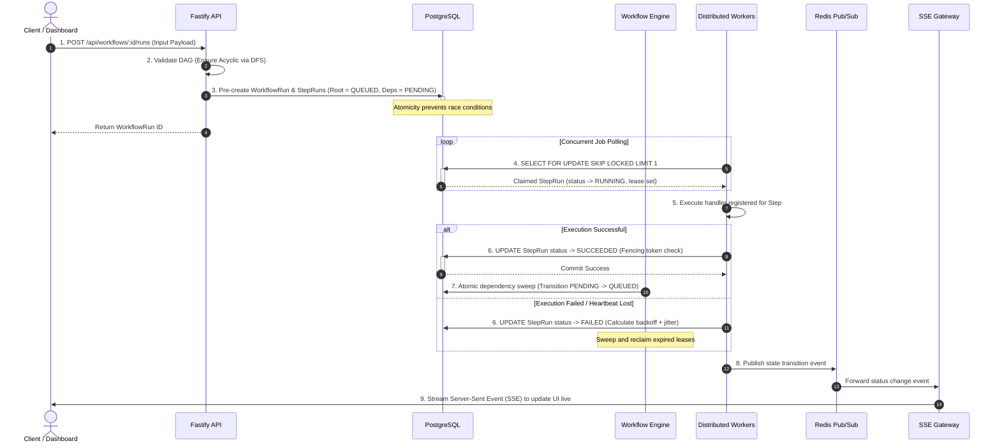

# FlowForge — Detailed System Design Guide & Architecture

Welcome to the **FlowForge System Design & Architectural Overview**! This guide is written specifically for Software Development Engineers (SDEs) to understand how a robust, distributed, stateful DAG workflow execution engine works under the hood.

---

## 1. High-Level System Architecture

Below is the visual system design diagram representing the components of FlowForge and how they coordinate:

This architecture demonstrates a clean separation of concerns between:
1. **User / Operator Interface** (Dashboard UI)
2. **Ingress & Control Plane** (Fastify API & Workflow Service)
3. **Durable State & Queue Storage** (PostgreSQL)
4. **DAG Orchestration Engine** (Workflow Engine / Scheduler)
5. **Horizontal Execution Plane** (Worker Pool + Handler Registry)
6. **Real-time Event Ingestion & Streaming** (Redis Pub/Sub & SSE Gateway)

---

## 2. End-to-End Execution Flow (The 9-Step Lifecycle)

A workflow execution follows this rigorous, step-by-step transaction model:

### Detailed Breakdown of the Steps:

1. **Workflow Ingress**: The user triggers a workflow by sending a JSON payload via REST API (`POST /api/workflows/:id/runs`).
2. **DAG Validation**: The API validates that all keys are unique, step handlers are registered, and the dependency structure is a **Directed Acyclic Graph (DAG)** with no loops, utilizing a Depth-First Search (DFS) check.
3. **Pre-creation Phase**: Instead of creating step rows dynamically, FlowForge pre-creates all `StepRun` rows in a single atomic transaction. The root steps (no dependencies) are set to `QUEUED`, while downstream dependent steps are set to `PENDING`. This completely prevents duplicate child execution when parents finish concurrently.
4. **Concurrency-Safe Job Claiming**: Horizontally scaled workers poll PostgreSQL concurrently using the `FOR UPDATE SKIP LOCKED` query. This claims exactly one eligible `QUEUED` step run atomically, transitioning its status to `RUNNING` and assigning a lease time (e.g., 30s) so other workers ignore it.
5. **Registry Execution**: The worker invokes the registered JavaScript/TypeScript handler (e.g. `embedding-generator`) with the mapped input parameters.
6. **Lease & Fencing Commit**: Upon completion, the worker commits the result back to PostgreSQL using a **Fencing Token** condition. This guarantees that if the worker had experienced a network pause and its lease expired, its output is discarded, preventing data corruption from "zombie workers".
7. **DAG Dependency Evaluation**: If the step succeeded, the **Workflow Engine** evaluates downstream dependent steps. If all parents for a child step are complete, that child transitions atomically from `PENDING` to `QUEUED`.
8. **Real-time Event Broadcast**: The worker publishes a status-change event (e.g., `step-succeeded`) to Redis Pub/Sub.
9. **Visual UI Sync**: The SSE Gateway forwards the Redis event down an open Server-Sent Events stream to the dashboard, which instantly updates the color and progress of the execution graph.

---

## 3. Why This Design Works (Interview & System-Level Strengths)

When presenting FlowForge in technical discussions or interviews, highlight these core engineering decisions:

### A. PostgreSQL as the Queue (SKIP LOCKED) vs. Dedicated Message Brokers (Kafka / RabbitMQ)
* **Complexity Tradeoff**: Dedicated brokers require maintaining dual state consistency (e.g. what if we save to Postgres but fail to push to SQS?). Using Postgres for both state and queue guarantees strict ACID transaction boundaries.
* **Concurrency Safety**: By using `SELECT FOR UPDATE SKIP LOCKED`, we perform transaction-level row locking. Workers don't wait for each other, preventing lock contention and thread starvation under high concurrent volume.

### B. At-Least-Once Semantics & Idempotency
* **Failure Tolerance**: Distributed systems *will* experience network splits or server crashes. FlowForge guarantees at-least-once execution by utilizing leases. If a worker dies, the background sweeper re-enqueues the task.
* **Registry Safeguards**: Because tasks may run multiple times, every `StepRun` includes a unique `idempotency_key` (e.g. `runId + stepId + attempt`). Registered handlers are designed to check if this key has already executed before modifying external databases or issuing side effects.

### C. Server-Sent Events (SSE) vs. WebSockets
* **Uni-directional Simplicity**: The dashboard is a read-only monitoring panel; it rarely sends real-time commands up to the backend. SSE provides a clean, one-way stream from backend to frontend.
* **Resiliency**: SSE has built-in connection recovery and automatic reconnection logic in the web browser, making it much more robust under poor network conditions compared to custom WebSocket retry layers.

---

## 4. Deep-Dive Service Architecture Guides

To examine the fine-grained implementation details, schemas, and flowcharts for each individual service, proceed to these detailed beginner-friendly SDE guides:

* 🔌 **[API Service Control Plane](services/api_service.md)** — Ingestion, input validation, and recursive DAG cycle detection.
* ⚙️ **[Workflow Orchestration Engine](services/scheduler_engine.md)** — Dependency resolution, atomic scheduling, and lease sweeping.
* 👷 **[Distributed Workers Plane](services/worker_system.md)** — Database polling, handler execution, heartbeats, and fencing protection.
* 📡 **[Real-time Stream & Updates Gateway](services/realtime_update_service.md)** — Redis Pub/Sub, SSE streaming, and the hybrid dashboard state sync pattern.
