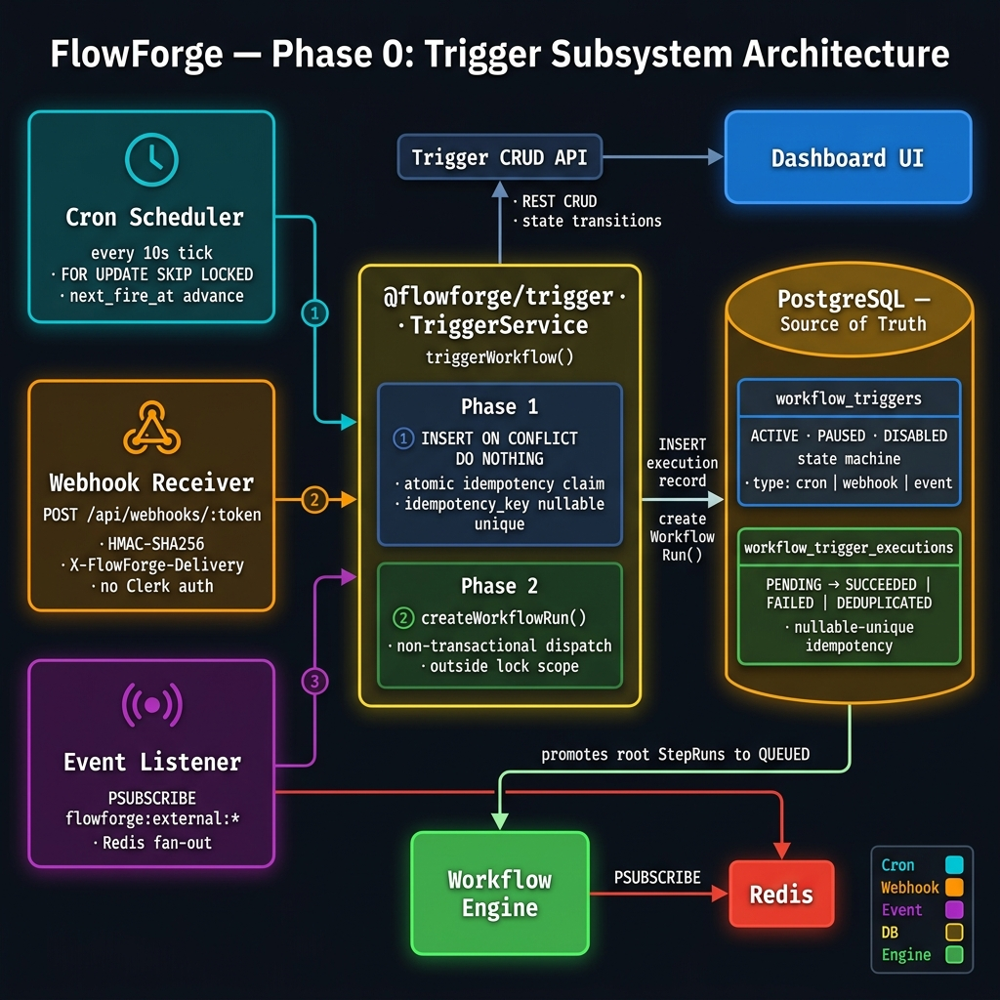
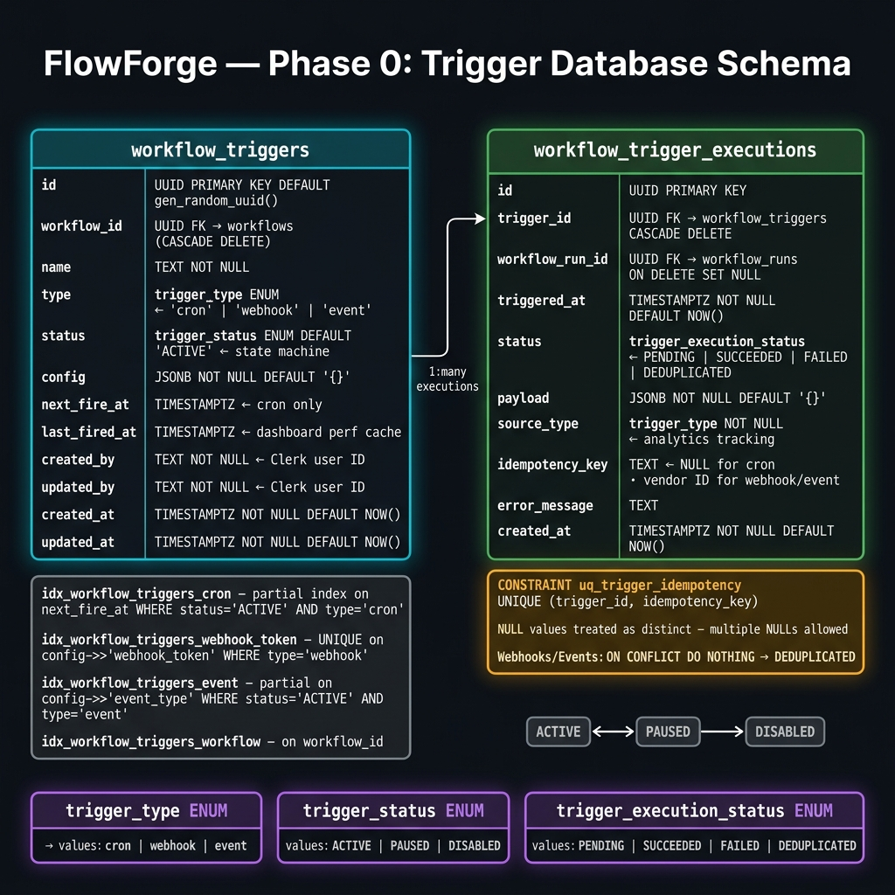
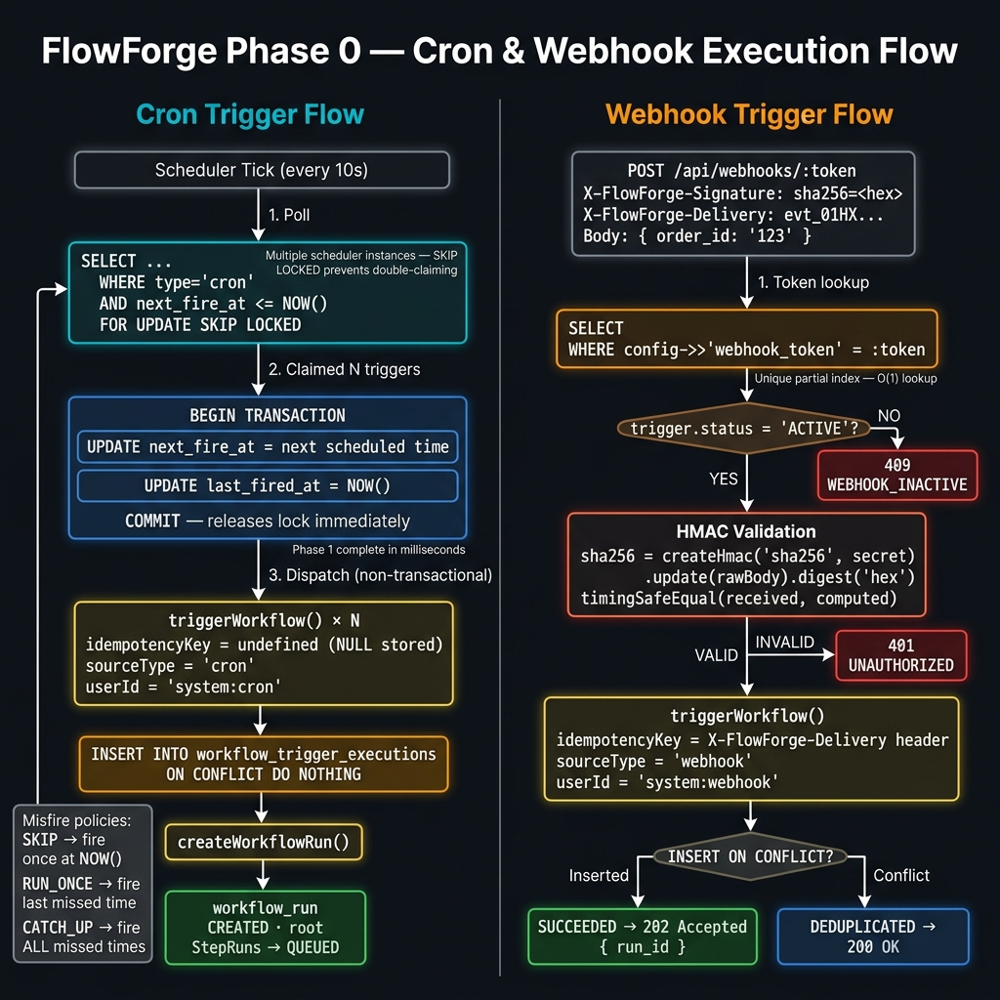
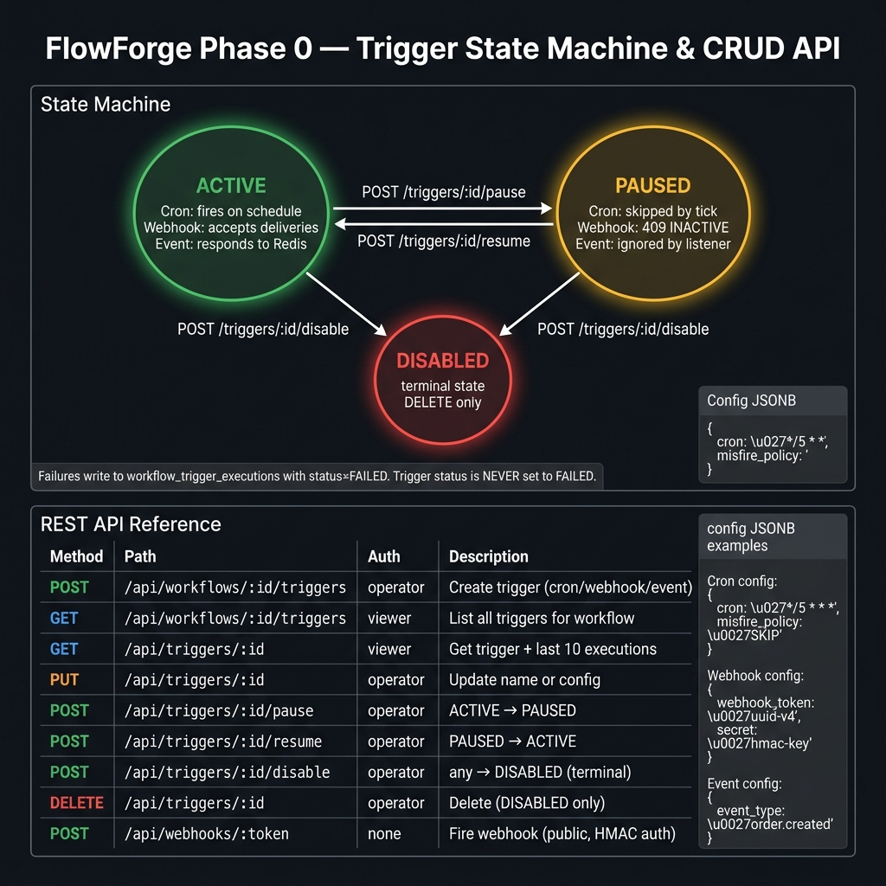
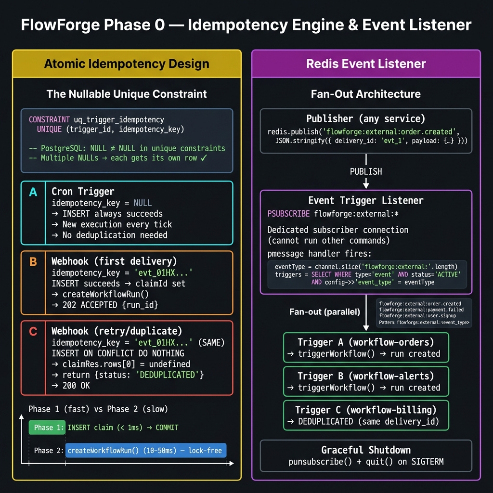

# FlowForge — Phase 0 Trigger Subsystem: Beginner SDE Guide

> **Who is this for?** SDE interns and SDE-1 engineers who want to understand *why* the Phase 0 trigger subsystem is designed the way it is — not just what it does, but the problems it solves and the engineering trade-offs behind every decision.

> **Read the diagrams in order.** Each section below explains one diagram in depth. Real code snippets and interview-ready insights are included throughout.

---

## 📌 How to Read This Guide

| # | Diagram | What You'll Learn |
|---|---------|-------------------|
| 1 | [System Architecture](#1-system-architecture--the-big-picture) | How three trigger types plug into one shared system |
| 2 | [Database Schema](#2-database-schema--where-state-lives) | The two new tables and why they're designed this way |
| 3 | [Cron & Webhook Flows](#3-cron--webhook-execution-flows) | Step-by-step execution for cron and webhook triggers |
| 4 | [State Machine & API](#4-trigger-state-machine--rest-api) | How trigger lifecycle is controlled and why |
| 5 | [Idempotency & Events](#5-idempotency-engine--event-listener) | The most important safety mechanism in the subsystem |

---

## 1. System Architecture — The Big Picture



### What Does This Show?

The full Phase 0 trigger subsystem at a glance. Three different ways to start a workflow automatically — all feeding into one shared service that enforces safety, then hands off to the existing workflow engine.

### Why Do We Need Triggers At All?

Without triggers, an operator must manually click "Run" in the dashboard every time. That's fine for development. In production, you need:

- **Cron**: "Run this data pipeline every night at 2am"
- **Webhook**: "Run this when GitHub pushes a commit"
- **Event**: "Run this when our payments service emits `payment.failed`"

### The Three Trigger Types — Explained Simply

| Trigger Type | Real-World Analogy | What Activates It |
|---|---|---|
| **Cron** | An alarm clock | Time passing — a scheduler checks every 10 seconds |
| **Webhook** | A doorbell | An external system calls your HTTP endpoint |
| **Event** | A notification bell | An internal service publishes a Redis message |

### Why Put ALL Three Through One `TriggerService`?

Look at the center box in the diagram: `@flowforge/trigger · TriggerService`. All three trigger types call the same `triggerWorkflow()` function.

This is intentional. The alternative would be:
- Cron scheduler directly calls `createWorkflowRun()`
- Webhook handler directly calls `createWorkflowRun()`
- Event listener directly calls `createWorkflowRun()`

The problem? **Idempotency logic lives in three different places.** If you fix a bug in one, you might forget the others. By funneling everything through one service, the atomic idempotency claim is **guaranteed no matter how the trigger fires**.

> 🔑 **Key Insight**: `TriggerService` is the **single enforcement point** for safety. Its job is: "Before you create a workflow run, let me make sure this exact event hasn't already been processed."

---

## 2. Database Schema — Where State Lives



### What Does This Show?

Two new PostgreSQL tables that form the persistence layer for all triggers. Understand these tables and you understand 80% of the subsystem.

### The Two Tables

#### `workflow_triggers` — Trigger Definitions

Think of this as the "recipe" for what should happen and when. One row = one configured trigger.

```sql
-- A real row might look like:
{
  id:           'a1b2c3d4-...',
  workflow_id:  'wf-123-...',     -- Which workflow does this fire?
  name:         'Nightly ETL Run',
  type:         'cron',           -- ENUM: cron | webhook | event
  status:       'ACTIVE',         -- ENUM: ACTIVE | PAUSED | DISABLED
  config:       { "cron": "0 2 * * *", "misfire_policy": "RUN_ONCE" },
  next_fire_at: '2026-06-04 02:00:00+05:30',  -- cron only
  last_fired_at: '2026-06-03 02:00:01+05:30', -- dashboard performance cache
}
```

#### `workflow_trigger_executions` — What Actually Happened

Think of this as the "log book" — every time a trigger fires (or tries to fire), a row is written here. One row = one firing attempt.

```sql
-- After a webhook fires successfully:
{
  id:               'exec-456-...',
  trigger_id:       'a1b2c3d4-...',
  workflow_run_id:  'run-789-...',  -- The run that was created
  status:           'SUCCEEDED',
  source_type:      'webhook',
  idempotency_key:  'evt_01HX...',  -- The vendor's delivery ID
  error_message:    null,
}
```

### Why Two Separate Tables?

**Beginner Mistake**: Putting execution history columns directly in `workflow_triggers`:

```sql
-- ❌ Bad design (don't do this)
ALTER TABLE workflow_triggers ADD COLUMN last_run_status TEXT;
ALTER TABLE workflow_triggers ADD COLUMN last_error TEXT;
```

This is bad because:
1. You can only store **one** execution result — you lose history
2. You can't see how many times a webhook was deduplicated vs. succeeded
3. You can't show a "last 10 executions" view in the dashboard

By separating the tables, `workflow_triggers` stays **small and fast** (one row per trigger), while `workflow_trigger_executions` accumulates the full history with one row per firing.

### The Four Indexes — Why Each One Exists

```sql
-- Index 1: Cron Claiming (partial index — only ACTIVE cron rows!)
CREATE INDEX idx_workflow_triggers_cron
  ON workflow_triggers(next_fire_at)
  WHERE status = 'ACTIVE' AND type = 'cron';
```

> **Why partial?** If you have 1000 triggers but only 200 are cron type and ACTIVE, the index only contains 200 entries instead of 1000. The scheduler tick runs every 10 seconds — this needs to be instantaneous.

```sql
-- Index 2: Webhook token lookup (unique partial index)
CREATE UNIQUE INDEX idx_workflow_triggers_webhook_token
  ON workflow_triggers((config->>'webhook_token'))
  WHERE type = 'webhook';
```

> **Why on a JSONB field?** The token is stored inside the `config` JSON column. PostgreSQL lets you index JSON subfields using the `->>'field'` expression syntax. This makes token lookup O(log N) instead of a full table scan.

```sql
-- Index 3: Event type matching
CREATE INDEX idx_workflow_triggers_event
  ON workflow_triggers((config->>'event_type'))
  WHERE status = 'ACTIVE' AND type = 'event';
```

> **Why does this matter?** When a Redis event fires, we need to find ALL matching triggers instantly. Without this index, we'd do a full table scan on every event — at high event volume that becomes a bottleneck.

```sql
-- Index 4: Dashboard list view
CREATE INDEX idx_workflow_triggers_workflow
  ON workflow_triggers(workflow_id);
```

> This just makes the "list all triggers for a workflow" API call fast. Without it, listing a workflow's triggers would scan the entire `workflow_triggers` table.

### The Nullable Unique Constraint — The Cleverest Part

```sql
CONSTRAINT uq_trigger_idempotency UNIQUE (trigger_id, idempotency_key)
```

This constraint protects against duplicate processing. But here's the clever bit: **`idempotency_key` can be NULL**. And PostgreSQL has a rule: `NULL ≠ NULL` in unique constraints. This means:

| `idempotency_key` | Result |
|---|---|
| `NULL` | Multiple `NULL` rows allowed for the same `trigger_id` — cron needs this! |
| `'evt_01HX'` (first time) | Inserts successfully |
| `'evt_01HX'` (second time) | Violates unique constraint → `ON CONFLICT DO NOTHING` → deduplicated |

This one constraint handles **both** use cases with zero application code.

---

## 3. Cron & Webhook Execution Flows



### What Does This Show?

The step-by-step execution paths for two trigger types. Understanding these flows is essential for debugging production issues.

---

### Cron Trigger Flow — The Two-Phase Pattern

#### Phase 1: Transactional Lock and Advance (Fast)

```typescript
// Inside a DB transaction
const dueRes = await client.query(`
  SELECT id, workflow_id, config, next_fire_at
  FROM workflow_triggers
  WHERE status = 'ACTIVE'
    AND type = 'cron'
    AND next_fire_at <= NOW()
  FOR UPDATE SKIP LOCKED  -- Claim this trigger exclusively
`);

// Advance the trigger's schedule IMMEDIATELY
await client.query(`
  UPDATE workflow_triggers
  SET next_fire_at = $1, last_fired_at = NOW()
  WHERE id = $2
`, [nextScheduledTime, trigger.id]);

await client.query('COMMIT'); // Release lock NOW — don't hold it!
```

#### Phase 2: Non-Transactional Dispatch (Slow, but lock-free)

```typescript
// OUTSIDE the transaction — lock is released
await triggerWorkflow(pool, {
  triggerId: trigger.id,
  workflowId: trigger.workflowId,
  payload: { scheduled_time: '2026-06-04T02:00:00Z' },
  sourceType: 'cron',
  userId: 'system:cron',
  // No idempotencyKey — cron always creates a fresh run
});
```

#### Why Split Into Two Phases?

**Beginner Question**: "Why not keep `triggerWorkflow()` inside the transaction?"

**The Problem**: `createWorkflowRun()` inside the engine does several DB writes:
1. INSERT into `workflow_runs`
2. INSERT into `step_runs` (one per step — could be 10-20 rows)
3. UPDATE `step_runs` status for root steps

If all of this runs while the `FOR UPDATE SKIP LOCKED` lock is held on `workflow_triggers`:

```
Worker A: Locks trigger_001 → starts createWorkflowRun()
          → inserts 15 step_run rows (takes 50ms)
          → STILL holding lock on trigger_001
Worker B: Tries to claim triggers → trigger_001 is locked → blocked
          → Can't claim ANY other triggers that are also due
```

By committing Phase 1 immediately (< 1ms), the lock is gone. Phase 2 runs with no locks held at all.

#### Misfire Policy — What Happens If the Scheduler Was Down?

Imagine the scheduler was offline for 3 hours, and you have a trigger set to run every 30 minutes. There are now 6 missed fires. What should happen?

```typescript
function resolveMisfireTimes(lastScheduled, cronExpr, policy) {
  if (policy === 'SKIP') return [new Date()];     // Fire once NOW, forget the rest
  if (policy === 'RUN_ONCE') return [mostRecentMissed]; // Fire the LAST missed time
  return allMissedTimes; // CATCH_UP: fire once for each missed time
}
```

| Policy | Use Case |
|---|---|
| `SKIP` | Heartbeat checks, health pings — "run now or never" |
| `RUN_ONCE` | Report generation — "just give me the latest" |
| `CATCH_UP` | Billing — "every missed tick represents money, don't skip any" |

---

### Webhook Trigger Flow — Security First

#### Step 1: Token Lookup

The URL `POST /api/webhooks/abc-123-token` encodes the identity of the trigger. The token is a **capability** — knowing it means you can fire the trigger. It's looked up via the unique partial index:

```sql
SELECT id, workflow_id, status, config
FROM workflow_triggers
WHERE type = 'webhook'
  AND config->>'webhook_token' = 'abc-123-token'  -- O(log N) via unique index
```

#### Step 2: HMAC Signature Validation

This is how we verify the request came from the **real** source (e.g., GitHub, Stripe) and not an attacker:

```
Sender computes:    signature = HMAC-SHA256(secret, requestBody)
Sender sends:       X-FlowForge-Signature: sha256=<hex>
Receiver computes:  expected = HMAC-SHA256(secret, rawRequestBody)
Receiver checks:    timingSafeEqual(received, expected)
```

**Why `timingSafeEqual` instead of `=== `?**

Standard string comparison short-circuits:
```
"abc" === "abd"
 ↑ match  ↑ mismatch → returns false immediately
```

An attacker can measure how long the comparison takes. If `"a"` takes 0.1ms and `"ab"` takes 0.2ms, they can brute-force the correct HMAC byte by byte. `timingSafeEqual` always compares all bytes in **constant time**, leaking no information.

#### Step 3: Idempotency Key

```
X-FlowForge-Delivery: evt_01HX4KWH8N5FXYZ
```

Webhook providers (GitHub, Stripe, etc.) set a unique delivery ID per event. They retry failed deliveries with the **same ID**. By using this as our `idempotency_key`, duplicate deliveries are silently deduplicated.

```
First  delivery: INSERT execution → claimId = 'exec-123' → creates run → 202 Accepted
Second delivery: INSERT ON CONFLICT DO NOTHING → claimId = undefined → 200 DEDUPLICATED
```

No extra logic. No database lookup. One constraint handles everything.

---

## 4. Trigger State Machine & REST API



### What Does This Show?

How a trigger's status changes over its lifetime, and the full API surface for managing triggers.

### The State Machine

```
                ┌─────────┐
         ┌─────►│  ACTIVE │◄─────┐
         │      └────┬────┘      │
    /resume          │ /pause   /resume
         │           ▼           │
         │      ┌─────────┐      │
         └──────│  PAUSED │──────┘
                └────┬────┘
                     │ /disable (from either ACTIVE or PAUSED)
                     ▼
               ┌──────────┐
               │ DISABLED │  ← terminal state
               └──────────┘
```

#### Why Only 3 States? Why No `FAILED` State?

**Beginner Question**: "What happens if a trigger fails to create a workflow run? Shouldn't it become `FAILED`?"

**The Answer**: A trigger's `status` represents **configuration state**, not **execution state**. Whether a single firing succeeded or failed is tracked in `workflow_trigger_executions.status`. The trigger itself is still correctly configured — it should keep trying.

If triggers could enter a `FAILED` state, you'd need a way to reset them. That's extra complexity with zero benefit. Instead:

- Each execution writes its result (SUCCEEDED / FAILED) to the executions table
- Operators can see failures in the execution history
- The trigger keeps firing — transient errors auto-recover on next tick

#### Why Is `DISABLED` Terminal?

Once you disable a trigger, re-enabling it would require deciding what to do with any missed fires. Should it catch up? Skip? Run once? These are hard questions with no universally correct answer.

By making `DISABLED` terminal:
1. Operators must consciously create a new trigger if they want to start again
2. The old trigger's execution history is preserved for audit
3. Codebase complexity is significantly reduced

To "re-enable," an operator creates a new trigger — which starts with a fresh `next_fire_at`.

### REST API Design Decisions

#### Why `POST /triggers/:id/pause` Instead of `PUT /triggers/:id` with `{ status: 'PAUSED' }`?

**Option A** (what we use — explicit transition endpoints):
```
POST /triggers/:id/pause
POST /triggers/:id/resume
POST /triggers/:id/disable
```

**Option B** (what beginners often suggest — generic update):
```
PUT /triggers/:id
Body: { "status": "PAUSED" }
```

**Why Option A wins:**

1. **Enforces state machine rules at the HTTP layer**: You can't accidentally send `{ status: 'ACTIVE' }` for a DISABLED trigger — there's no such route.
2. **Simpler authorization logic**: Each action can have its own permission check.
3. **Clearer audit logs**: `action: 'TRIGGER_PAUSED'` is more readable than `action: 'TRIGGER_UPDATED'`.
4. **Aligns with REST idioms for commands**: CRUD (`PUT`) is for data, not state transitions. State transitions are commands — they use `POST`.

#### Why Can You Only Delete `DISABLED` Triggers?

```typescript
fastify.delete('/triggers/:triggerId', async (req, reply) => {
  const res = await db.query(
    `DELETE FROM workflow_triggers
     WHERE id = $1 AND status = 'DISABLED'  -- ← This guard
     RETURNING id`,
    [triggerId]
  );
  if (!res.rows[0]) {
    return reply.status(409).send({ error: 'CANNOT_DELETE' });
  }
});
```

Deleting an ACTIVE trigger could cause:
- A webhook delivery to arrive a millisecond after deletion → 404 on token lookup → delivery lost
- A cron tick to try to claim the trigger → race with deletion → DB constraint error

By requiring DISABLED first, the operator must explicitly stop the trigger before removing it. This adds a "safety switch" — accidental deletions are caught.

---

## 5. Idempotency Engine & Event Listener



### What Does This Show?

Two critical mechanisms: the nullable-unique idempotency system (the safety spine of the entire subsystem), and the Redis Pub/Sub event fan-out architecture.

---

### The Idempotency Engine — Deep Dive

#### What Problem Does It Solve?

In distributed systems, events can be delivered **more than once**. This is not a bug — it's a fundamental property of networks:

```
Scenario: GitHub webhook delivery
1. GitHub sends POST to your endpoint
2. Your server processes it, creates workflow run
3. Your server takes 3 seconds to respond (congestion)
4. GitHub's 2-second timeout fires → GitHub retries with same delivery ID
5. Now your server receives the SAME event TWICE
```

Without idempotency handling: **two workflow runs created for one event**. Charges could be doubled. Data could be corrupted. Results could be wrong.

#### The Solution: Insert-Based Idempotency

```typescript
// This is the most important function in Phase 0
async function triggerWorkflow(pool, opts) {

  // ATTEMPT to claim this execution slot
  const claimRes = await pool.query(`
    INSERT INTO workflow_trigger_executions
      (trigger_id, status, payload, idempotency_key, source_type)
    VALUES ($1, 'PENDING', $2, $3, $4)
    ON CONFLICT (trigger_id, idempotency_key) DO NOTHING
    RETURNING id
  `, [opts.triggerId, opts.payload, opts.idempotencyKey ?? null, opts.sourceType]);

  const claimId = claimRes.rows[0]?.id; // undefined if conflict

  if (!claimId) {
    return { status: 'DEDUPLICATED' }; // Already processed this event
  }

  // Safe to proceed — we won the race
  const run = await createWorkflowRun(pool, opts.workflowId, opts.payload, opts.userId);
  // ... update execution status to SUCCEEDED
  return { status: 'SUCCEEDED', runId: run.id };
}
```

#### Why `INSERT` for Idempotency (Not `SELECT` First)?

**Beginner Approach (Wrong)**:
```typescript
// ❌ Check-then-Act — has a race condition!
const existing = await db.query(
  'SELECT id FROM workflow_trigger_executions WHERE trigger_id = $1 AND idempotency_key = $2',
  [triggerId, key]
);
if (!existing.rows[0]) {
  await db.query('INSERT INTO workflow_trigger_executions ...'); // Race here!
  await createWorkflowRun();
}
```

**The Race Condition**:
```
Thread A: SELECT → finds nothing
Thread B: SELECT → finds nothing (both see empty at same time!)
Thread A: INSERT → succeeds
Thread B: INSERT → also succeeds (both think they're first!)
→ Two workflow runs created 💥
```

**The Correct Approach (What We Use)**:
```typescript
// ✅ Single atomic INSERT with ON CONFLICT — no race condition possible
INSERT INTO ... ON CONFLICT DO NOTHING RETURNING id
-- If conflict: returns 0 rows (already exists)
-- If no conflict: returns the new row (we won the race)
-- The database handles this atomically — impossible to race
```

The database lock ensures only **one** of the concurrent inserts wins. Losers get 0 rows back and return `DEDUPLICATED`. This is the standard idempotency pattern for distributed systems.

#### The Nullable Unique Trick — Why NULL Works for Cron

```sql
CONSTRAINT uq_trigger_idempotency UNIQUE (trigger_id, idempotency_key)
```

PostgreSQL's rule: **NULL is not equal to any value, including other NULLs**.

This means:
- `('trigger-1', NULL)` and `('trigger-1', NULL)` are **not duplicates**
- Both can coexist in the table simultaneously

**For cron triggers**, there is no external delivery ID. Every tick should create a new execution. By passing `idempotencyKey: undefined` (which becomes `NULL` in the DB), the unique constraint never fires — every cron tick always inserts successfully.

**For webhooks/events**, the vendor's delivery ID is passed as `idempotencyKey`. The constraint deduplicates retries.

One constraint, two behaviors, zero application logic branches.

---

### The Redis Event Listener — Fan-Out Architecture

#### Why Redis Pub/Sub for Events?

**Alternative considered**: HTTP polling — every service checks an endpoint every N seconds.
**Problem**: Polling is inefficient. If you have 10 services each polling every 5 seconds, that's 2 requests/second of wasted load, even when there's nothing to process.

**Alternative considered**: Direct function call inside the same process.
**Problem**: Tight coupling. Every service that wants to trigger a workflow needs to import `@flowforge/trigger` and know about it.

**Redis Pub/Sub**: Services publish events to a channel. Any service subscribed to that channel receives them instantly. Completely decoupled — the publisher doesn't know who's listening.

#### The `PSUBSCRIBE` Pattern

```typescript
// Subscribe to ALL event channels with one command
subscriber.psubscribe('flowforge:external:*');

// When order.created fires:
// channel = 'flowforge:external:order.created'
// eventType = 'order.created'

subscriber.on('pmessage', async (pattern, channel, message) => {
  const eventType = channel.slice('flowforge:external:'.length);

  // Find ALL matching ACTIVE event triggers
  const triggers = await db.query(`
    SELECT id, workflow_id
    FROM workflow_triggers
    WHERE type = 'event'
      AND status = 'ACTIVE'
      AND config->>'event_type' = $1
  `, [eventType]);

  // Fan-out: fire ALL of them
  for (const trigger of triggers) {
    await triggerWorkflow(pool, { triggerId: trigger.id, ... });
  }
});
```

**Why `PSUBSCRIBE` (pattern subscribe) instead of `SUBSCRIBE` per channel?**

`SUBSCRIBE` requires you to know the exact channel name in advance. But event trigger types are created at runtime by operators — you can't know them at startup.

`PSUBSCRIBE` uses a wildcard pattern `flowforge:external:*` to match **all** event channels with a single subscription. When a new event type is created, it's automatically matched without any code change.

#### Why a Dedicated Subscriber Connection?

```typescript
export function getRedisSubscriber(): Redis {
  return new Redis(process.env.REDIS_URL);
  // ← This creates a NEW connection, separate from the regular pool
}
```

Redis has a rule: once a connection enters `SUBSCRIBE` or `PSUBSCRIBE` mode, it **can only receive messages** — it cannot send commands like `GET`, `SET`, or `PUBLISH`.

If we reused the shared Redis client:
```typescript
// ❌ This would break the shared Redis client
redisClient.psubscribe('flowforge:external:*');
// Now redisClient can't publish events anymore!
redisClient.publish('step.succeeded', '...'); // ERROR: subscribed client
```

By creating a dedicated subscriber connection, the main Redis client stays free for regular commands (publish, get, set), while the subscriber connection handles all incoming events.

---

## 🗺️ End-to-End: What Happens When an Order Is Created?

Walk through the complete flow from event to running workflow:

```
1. payments-service finishes processing order-789
   ↓
2. payments-service publishes to Redis:
   PUBLISH flowforge:external:order.created
   '{"delivery_id":"evt_abc","payload":{"order_id":"ord-789","amount":9900}}'
   ↓
3. Event Trigger Listener receives the pmessage
   eventType = 'order.created'
   ↓
4. DB lookup: SELECT triggers WHERE event_type = 'order.created' AND status = 'ACTIVE'
   → Finds Trigger A (workflow: "process-order") and Trigger B (workflow: "send-invoice")
   ↓
5. For Trigger A: triggerWorkflow()
   → INSERT INTO workflow_trigger_executions (idempotency_key = 'evt_abc')
   → INSERT succeeds (first time this delivery) → claimId = 'exec-001'
   → createWorkflowRun(workflowId: 'process-order', payload: {order_id: 'ord-789'})
   → 15 step_run rows created, root steps → QUEUED
   → Workers pick them up immediately
   ↓
6. For Trigger B: triggerWorkflow()
   → INSERT INTO workflow_trigger_executions (idempotency_key = 'evt_abc')
   → INSERT succeeds (different trigger_id, so no conflict) → creates second run
   → "send-invoice" workflow starts
   ↓
7. 500ms later, payments-service retries (timeout) with same delivery_id 'evt_abc'
   ↓
8. Event Listener receives again, calls triggerWorkflow() for Trigger A again
   → INSERT ON CONFLICT DO NOTHING → 0 rows → DEDUPLICATED → no second run
   → Same for Trigger B → DEDUPLICATED
   ↓
9. Only 2 workflow runs exist (one per trigger), not 4 ✅
```

---

## 🎯 Interview Cheat Sheet — Phase 0 Questions

| Question | Your Answer |
|---|---|
| "Why route all triggers through one `triggerWorkflow()` function?" | Single enforcement point for idempotency. Fixes in one place apply to all trigger types. |
| "How do you prevent a webhook from firing twice?" | Nullable-unique `(trigger_id, idempotency_key)` constraint. `INSERT ON CONFLICT DO NOTHING` returns 0 rows on duplicate. |
| "Why does the cron scheduler use two phases?" | Phase 1 commits the lock release immediately. Phase 2 dispatches outside the lock. Holding the lock during `createWorkflowRun()` would block all other triggers from being claimed. |
| "How does HMAC signature validation work?" | Shared secret. Both sides compute `HMAC-SHA256(secret, rawBody)`. Use `timingSafeEqual` (not `===`) to prevent timing oracle attacks. |
| "Why `PSUBSCRIBE` instead of `SUBSCRIBE` per channel?" | Event types are created at runtime. `PSUBSCRIBE flowforge:external:*` matches all future channels without code changes. |
| "Why is `DISABLED` a terminal state for triggers?" | Prevents ambiguous re-activation. Operator creates a new trigger to restart — cleaner audit trail, no missed-fire policy ambiguity. |
| "Why can't you delete an ACTIVE trigger?" | Prevents race between arriving deliveries and deletion. Requires explicit DISABLE step as a safety switch. |
| "What's the difference between trigger status and execution status?" | `trigger.status` = configuration lifecycle (ACTIVE/PAUSED/DISABLED). `execution.status` = what happened when it fired (SUCCEEDED/FAILED/DEDUPLICATED). |
| "Why does cron use `NULL` for idempotency_key?" | PostgreSQL: `NULL ≠ NULL` in unique constraints. Multiple NULLs can coexist, allowing every cron tick to insert without deduplication. |
| "Why dedicate a separate Redis connection for subscribing?" | Redis subscriber connections can only receive messages — they can't run any other commands. Sharing would corrupt the main client. |

---

## 📁 Related Files

- [Phase 0 Spec Files](../../flowforge/context/phase0_specs/) — Detailed implementation specs for all 7 units
- [Architecture Doc](../../flowforge/context/architecture.md) — Full system boundaries and invariants
- [Phase 0 Build Plan](../../flowforge/context/phase0_specs/00_build_plan.md) — Build order and guiding rules
- [Phase 1 Beginner Guide](../iamges/BEGINNER_GUIDE.md) — The core system (workers, DAG engine, fencing)
