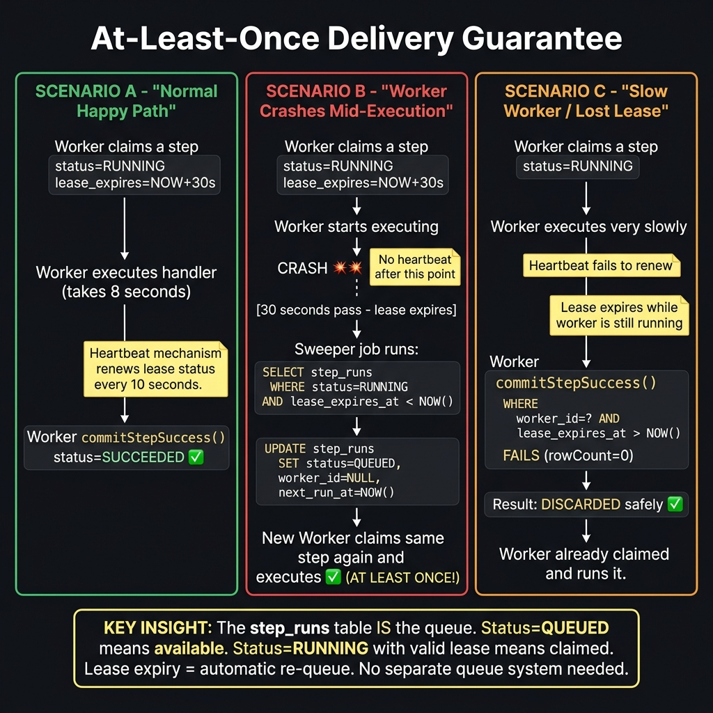
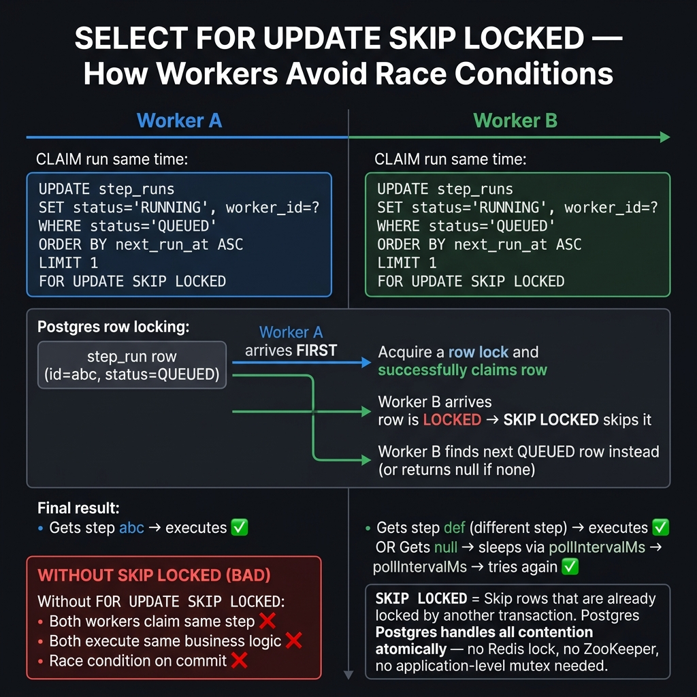
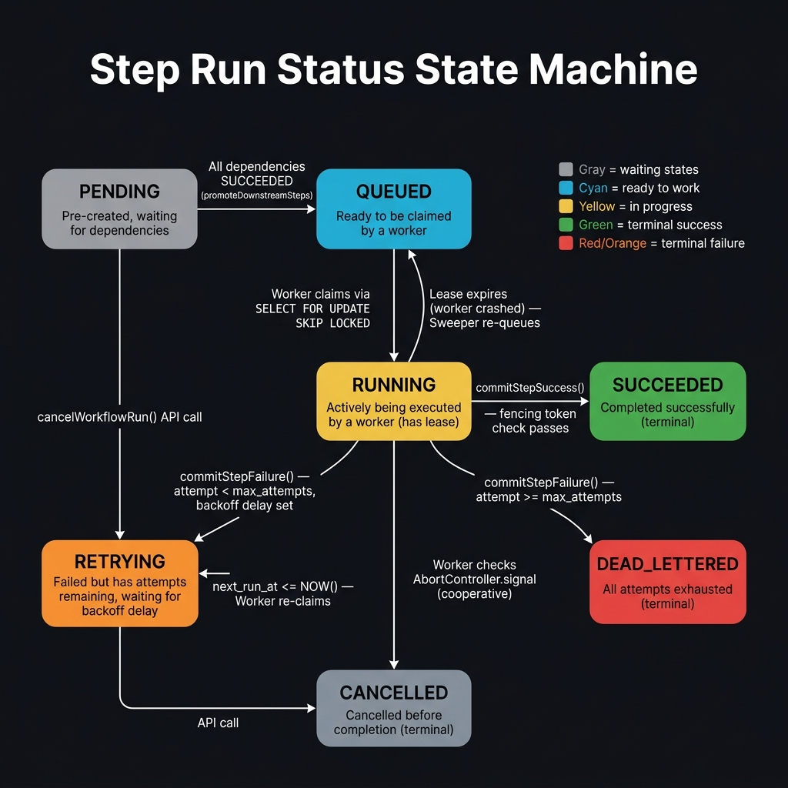
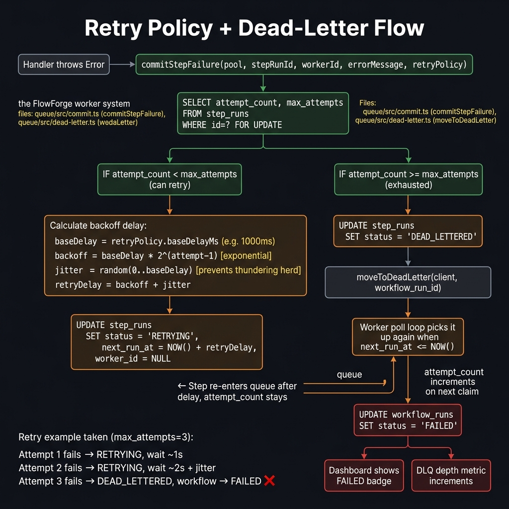
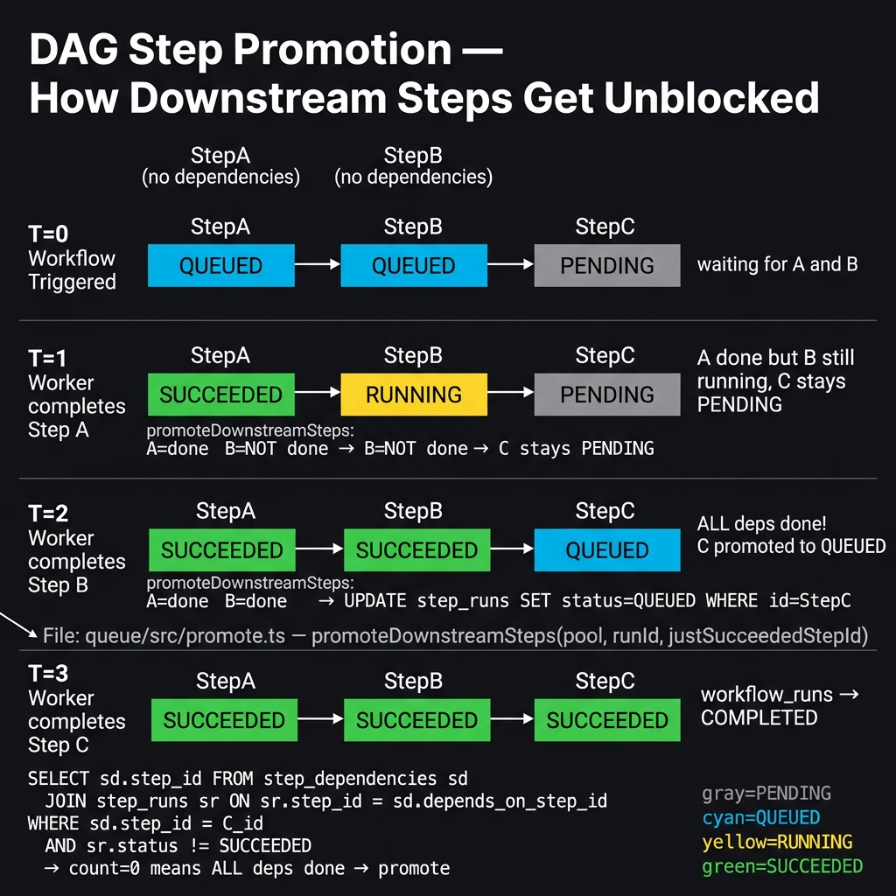

# FlowForge — Beginner SDE Questions & Answers

> These are the most important conceptual questions a beginner engineer should understand
> about the FlowForge distributed job worker system. Each answer is explained from first
> principles with diagrams and exact file references.

---

## Table of Contents

1. [How do we ensure at-least-once delivery?](#1-how-do-we-ensure-at-least-once-delivery)
2. [How do two workers avoid claiming the same step?](#2-how-do-two-workers-avoid-claiming-the-same-step)
3. [What is the difference between PENDING and QUEUED?](#3-what-is-the-difference-between-pending-and-queued)
4. [What is a fencing token and why do we need it?](#4-what-is-a-fencing-token-and-why-do-we-need-it)
5. [What happens when a step fails? Retry vs Dead-Letter?](#5-what-happens-when-a-step-fails-retry-vs-dead-letter)
6. [How does the DAG (step dependency) execute in order?](#6-how-does-the-dag-step-dependency-execute-in-order)
7. [How does cancel work when a step is mid-execution?](#7-how-does-cancel-work-when-a-step-is-mid-execution)
8. [Why does the worker NOT publish SSE events directly?](#8-why-does-the-worker-not-publish-sse-events-directly)
9. [What is idempotency and why does it matter here?](#9-what-is-idempotency-and-why-does-it-matter-here)
10. [What is the sweeper and why is it needed?](#10-what-is-the-sweeper-and-why-is-it-needed)
11. [Why are step rows pre-created before execution starts?](#11-why-are-step-rows-pre-created-before-execution-starts)
12. [What is the AbortController.signal and how is it used?](#12-what-is-the-abortcontrollersignal-and-how-is-it-used)

---

## 1. How do we ensure at-least-once delivery?

> **Short answer:** Through **lease expiry + the sweeper**. If a worker dies, its lease
> naturally expires, and the sweeper re-queues the step for another worker to pick up.



### The full mechanism

"At-least-once delivery" means: **every step will be executed at least one time**, even if
a worker crashes mid-execution. It may run more than once (hence "at least once", not
"exactly once"), so handlers should ideally be idempotent.

Here's how it works in three scenarios:

#### Scenario A — Happy path (step runs once)
```
Worker claims step  →  status=RUNNING, worker_id=W1, lease_expires_at=NOW+30s
Heartbeat renews lease every 10s  (lease_expires_at keeps moving forward)
Handler completes  →  commitStepSuccess()
WHERE worker_id=W1 AND lease_expires_at > NOW()  →  rowCount=1 ✅
status=SUCCEEDED
```

#### Scenario B — Worker crashes (step re-runs on another worker)
```
Worker W1 claims step  →  status=RUNNING, lease_expires_at=NOW+30s
Worker W1 CRASHES 💥  →  no more heartbeats
[30 seconds pass]  →  lease_expires_at is now in the past
Sweeper runs:
  SELECT * FROM step_runs
  WHERE status='RUNNING' AND lease_expires_at < NOW()
  →  finds our step
  UPDATE SET status='QUEUED', worker_id=NULL, next_run_at=NOW()
Worker W2 polls  →  claims the step  →  executes it  ✅  (at-least-once!)
```

#### Scenario C — Worker too slow / lost lease (result safely discarded)
```
Worker W1 claims step  →  lease_expires_at=NOW+30s
W1 is very slow, heartbeat stops working  →  lease expires
Worker W2 claims the same step (lease expired, looks QUEUED again)
W1 finally finishes, tries to commit:
  commitStepSuccess()
  WHERE id=step AND worker_id=W1 AND lease_expires_at > NOW()
  →  worker_id is now W2, not W1  →  rowCount=0
W1's result is DISCARDED safely ✅  (fencing token prevents stale write)
W2 commits its result ✅
```

### Key insight

> **The `step_runs` table IS the queue.** There is no separate queue broker (no RabbitMQ,
> no Kafka). `status=QUEUED` means "available to claim". `status=RUNNING` with a valid
> lease means "claimed". Lease expiry = automatic re-queue. This is called
> **"Postgres as a queue"** pattern.

### Files involved
| File | Role |
|---|---|
| `flowforge/packages/queue/src/claim.ts` | Claims step — sets RUNNING + lease |
| `flowforge/packages/worker/src/lease-heartbeat.ts` | Renews `lease_expires_at` on interval |
| `flowforge/packages/queue/src/sweeper.ts` | Re-queues expired leases |
| `flowforge/packages/queue/src/commit.ts` | Fencing token check on commit |

---

## 2. How do two workers avoid claiming the same step?

> **Short answer:** `SELECT FOR UPDATE SKIP LOCKED` — Postgres atomically locks the row
> for one worker and skips it for all others. No distributed lock needed.



### What SKIP LOCKED does

When two workers both run the claim query at the same moment:

```sql
UPDATE step_runs
SET status = 'RUNNING', worker_id = $workerId, lease_expires_at = NOW() + interval '30 seconds'
WHERE id = (
  SELECT id FROM step_runs
  WHERE status = 'QUEUED' AND next_run_at <= NOW()
  ORDER BY next_run_at ASC
  LIMIT 1
  FOR UPDATE SKIP LOCKED   ← the magic
)
RETURNING *;
```

- **Worker A** arrives first → Postgres **locks** row `id=abc` → A claims it
- **Worker B** arrives nanoseconds later → row `id=abc` is **LOCKED** → `SKIP LOCKED`
  makes B skip it and move to the next available row (`id=def`)
- Both workers get **different** steps → no collision

### What happens without SKIP LOCKED (the bad way)

Without `SKIP LOCKED`, both workers would wait on the same row. When the lock is released,
both would try to UPDATE the same row, causing:
- Duplicate execution of the same step ❌
- Race condition on commit ❌
- Incorrect `worker_id` tracking ❌

### Why not use Redis / Zookeeper for distributed locking?

Postgres `SELECT FOR UPDATE SKIP LOCKED` gives you the equivalent of a distributed lock
**inside the same transaction** that also updates the state. It's atomic, durable, and
requires no additional infrastructure.

### File
`flowforge/packages/queue/src/claim.ts` — `claimNextStep()`

---

## 3. What is the difference between PENDING and QUEUED?

> **Short answer:** `PENDING` = step exists but is blocked by unfinished dependencies.
> `QUEUED` = step is ready to be claimed by a worker right now.



### Full status reference

| Status | Meaning | Who sets it | Terminal? |
|---|---|---|---|
| `PENDING` | Pre-created, waiting for dependency steps to succeed | `createWorkflowRun()` on trigger | No |
| `QUEUED` | Ready — no pending dependencies, available to be claimed | `promoteDownstreamSteps()` or trigger (root steps) | No |
| `RUNNING` | Actively being executed by a worker (has an active lease) | `claimNextStep()` | No |
| `SUCCEEDED` | Completed successfully | `commitStepSuccess()` | ✅ Yes |
| `RETRYING` | Failed but has remaining attempts — waiting for backoff delay | `commitStepFailure()` | No |
| `DEAD_LETTERED` | All retry attempts exhausted | `commitStepFailure()` | ✅ Yes |
| `CANCELLED` | Cancelled by user before it could complete | `cancelWorkflowRun()` | ✅ Yes |

### Why PENDING exists at all

When a workflow is triggered, **all step rows are created immediately** in PENDING state
(see Q11 for why). Steps with no dependencies are promoted to QUEUED right away. Steps
that have dependencies must wait in PENDING until those dependencies SUCCEED.

```
Workflow: A → C, B → C   (C depends on both A and B)

On trigger:
  A: PENDING → QUEUED immediately (root step)
  B: PENDING → QUEUED immediately (root step)
  C: PENDING           ← stays PENDING until A and B both SUCCEED
```

### Files
- Statuses defined: `flowforge/packages/shared/src/status.ts`
- Transitions in: `flowforge/packages/queue/src/claim.ts`, `commit.ts`, `promote.ts`
- Initial creation: `flowforge/packages/engine/src/run-creator.ts`

---

## 4. What is a fencing token and why do we need it?

> **Short answer:** A fencing token is extra data in the `WHERE` clause of a write
> that makes "stale writes" from zombie workers automatically fail without any
> coordination between workers.

### The problem it solves

Imagine this timeline:
```
T=0   Worker W1 claims step, lease_expires_at = T+30s
T=15  W1 is paused (GC pause, network hiccup, etc.)
T=31  Lease expires. Sweeper re-queues the step.
T=32  Worker W2 claims the same step, starts executing.
T=45  W1 wakes up from its pause and finishes executing.
```

Without a fencing token:
- W1 does `UPDATE step_runs SET status='SUCCEEDED' WHERE id=step_id` ← overwrites W2's work ❌

With a fencing token:
```sql
UPDATE step_runs
SET status = 'SUCCEEDED', output_payload = $output
WHERE id = $stepRunId
  AND worker_id = $workerId          ← fencing token #1
  AND status = 'RUNNING'
  AND lease_expires_at > NOW();      ← fencing token #2
```

- W1 sends `worker_id = 'W1'` but the DB now has `worker_id = 'W2'` → `WHERE` fails → `rowCount = 0`
- W1 sees `rowCount = 0` → logs "lost lease, discarding result" → moves on safely ✅
- W2's execution continues untouched ✅

### The two fencing conditions

| Condition | Catches |
|---|---|
| `worker_id = $workerId` | Another worker claimed the step (my worker_id is stale) |
| `lease_expires_at > NOW()` | My own lease expired (I was too slow even for myself) |

### File
`flowforge/packages/queue/src/commit.ts` — `commitStepSuccess()` and `commitStepFailure()`

---

## 5. What happens when a step fails? Retry vs Dead-Letter?

> **Short answer:** If `attempt_count < max_attempts` → RETRYING with exponential backoff.
> If `attempt_count >= max_attempts` → DEAD_LETTERED, and the whole workflow → FAILED.



### The retry flow

When a handler throws an error, `commitStepFailure()` is called:

```ts
// queue/src/commit.ts — commitStepFailure()

if (attempt_count < max_attempts) {
  // Exponential backoff with jitter
  const backoff = baseDelayMs * Math.pow(2, attempt - 1);
  const jitter  = Math.floor(Math.random() * baseDelayMs);
  const retryDelayMs = backoff + jitter;

  UPDATE step_runs SET
    status = 'RETRYING',
    error_message = $error,
    next_run_at = NOW() + retryDelayMs ms,
    worker_id = NULL,
    lease_expires_at = NULL
  WHERE id = $stepRunId;
  // Step re-enters the queue after the delay
} else {
  // All attempts exhausted
  UPDATE step_runs SET status = 'DEAD_LETTERED' WHERE id = $stepRunId;
  moveToDeadLetter(client, workflow_run_id);
  // → UPDATE workflow_runs SET status = 'FAILED'
}
```

### Exponential backoff example (baseDelayMs = 1000, max_attempts = 3)

| Attempt | Formula | Backoff | Jitter (random) | Total wait |
|---|---|---|---|---|
| 1 | 1000 × 2^0 | 1000ms | ~0–1000ms | ~1–2 seconds |
| 2 | 1000 × 2^1 | 2000ms | ~0–1000ms | ~2–3 seconds |
| 3 (final) | — | — | — | DEAD_LETTERED |

### Why jitter?

Without jitter, all retrying steps that failed at the same time would retry at exactly
the same moment — creating a **thundering herd** that could overwhelm the database.
Random jitter spreads them out.

### What happens to the workflow when a step is dead-lettered?

```
step → DEAD_LETTERED
  └─► moveToDeadLetter(client, workflow_run_id)
        └─► UPDATE workflow_runs SET status = 'FAILED'
              └─► DLQ depth metric increments in /api/stats
                    └─► Dashboard shows warning banner: "Operational warning — DLQ active"
```

### Files
| File | Role |
|---|---|
| `flowforge/packages/queue/src/commit.ts` | `commitStepFailure()` — retry vs dead-letter logic |
| `flowforge/packages/queue/src/dead-letter.ts` | `moveToDeadLetter()` — marks workflow FAILED |
| `flowforge/packages/api/src/routes/stats.ts` | Returns `dlqDepth` for the dashboard warning banner |

---

## 6. How does the DAG (step dependency) execute in order?

> **Short answer:** `promoteDownstreamSteps()` runs after every successful step commit.
> It checks if all dependencies of each downstream step are now SUCCEEDED — if yes,
> it promotes that step to QUEUED so workers can pick it up.



### The dependency table

The database has a `step_dependencies` table:
```
step_dependencies:
  step_id             → the step that has a dependency
  depends_on_step_id  → the step it must wait for
```

For a workflow `A → C, B → C`:
```
step_id = C,  depends_on_step_id = A
step_id = C,  depends_on_step_id = B
```

### The promotion SQL (simplified)

After step `X` succeeds, `promoteDownstreamSteps(pool, runId, X.step_id)` runs:

```sql
-- Find all steps that depend on X
SELECT sd.step_id as downstream_id
FROM step_dependencies sd
WHERE sd.depends_on_step_id = $justSucceededStepId

-- For each downstream step, check if ALL its deps are SUCCEEDED
SELECT COUNT(*)
FROM step_dependencies sd
JOIN step_runs sr ON sr.step_id = sd.depends_on_step_id
WHERE sd.step_id = $downstreamId
  AND sr.workflow_run_id = $runId
  AND sr.status != 'SUCCEEDED'
-- count = 0 means ALL deps are done → promote!

UPDATE step_runs
SET status = 'QUEUED', next_run_at = NOW()
WHERE id = $downstreamStepRunId
  AND status = 'PENDING';
```

### Why no polling / scheduler for promotion?

Promotion is **synchronous** — it runs inside the same call stack right after
`commitStepSuccess()`. There is no background job or timer that checks "are dependencies
done yet?". This means promotion happens within milliseconds of the dependency completing.

```
commitStepSuccess(stepA) → rowCount=1 ✅
  └─► promoteDownstreamSteps(runId, stepA.step_id)
        └─► finds StepC depends on A and B
        └─► B.status = SUCCEEDED → count of unfinished deps = 0
        └─► UPDATE step_runs SET status=QUEUED WHERE id=StepC
              └─► workers immediately see StepC as claimable
```

### File
`flowforge/packages/queue/src/promote.ts` — `promoteDownstreamSteps()`

---

## 7. How does cancel work when a step is mid-execution?

> **Short answer:** For steps that are PENDING or QUEUED — DB update cancels them
> immediately. For steps that are RUNNING — the API sends an `AbortController` signal
> to the worker via the `AbortController.signal` passed into the handler, which can
> cooperatively check it and stop early.

### Two scenarios

#### Steps not yet started (PENDING or QUEUED)
```
POST /api/runs/:id/cancel
  └─► cancelWorkflowRun(pool, runId)
        └─► UPDATE step_runs
            SET status = 'CANCELLED'
            WHERE workflow_run_id = $runId
              AND status IN ('PENDING', 'QUEUED')
```
These steps are cancelled instantly in the DB — no worker ever claims them again.

#### Steps currently RUNNING
```
A worker is mid-handler:
  handler({ signal: abortController.signal, ... }, input)

The cancel API sets status=CANCELLED in DB.
The worker's next heartbeat or commitStepSuccess() will see:
  WHERE worker_id = $workerId AND lease_expires_at > NOW()
  → step is now CANCELLED, not RUNNING → rowCount = 0
  → worker detects this, discards result

For IMMEDIATE cancellation (before commit):
  The handler itself must check signal.aborted:
  if (ctx.signal.aborted) {
    throw new Error('Step cancelled by operator');
  }
```

### What is AbortController.signal?

`AbortController` is a browser/Node.js native API that lets you signal cancellation:

```ts
// Worker creates one per step (poll-loop.ts):
const abortController = new AbortController();
ctx.activeControllers.set(stepRunId, abortController);

// Signal is passed INTO the handler:
handler({
  signal: abortController.signal,  // ← this
  workflowRunId, stepRunId, attempt, logger
}, input);

// Handler CAN check it:
async function myHandler(ctx, input) {
  for (const item of items) {
    if (ctx.signal.aborted) {
      throw new Error('Cancelled');   // stop processing
    }
    await processItem(item);
  }
}

// Or pass to fetch() for HTTP cancellation:
const response = await fetch(url, { signal: ctx.signal });
// fetch automatically aborts when signal fires ✅
```

### Important caveat

The cancel API does **not** forcibly kill the worker process. It:
1. Marks PENDING/QUEUED steps as CANCELLED in DB
2. Sets the workflow to CANCELLED
3. Relies on handlers to **cooperatively** check `signal.aborted`

A handler that ignores `signal.aborted` will run to completion — its commit just fails
silently (fencing token mismatch since the step is now CANCELLED, not RUNNING).

### Files
| File | Role |
|---|---|
| `flowforge/packages/api/src/routes/runs/cancel.ts` | REST handler — updates DB, publishes SSE event |
| `flowforge/packages/engine/src/cancel.ts` | `cancelWorkflowRun()` — bulk DB cancellation |
| `flowforge/packages/worker/src/poll-loop.ts` | Creates `AbortController`, passes `signal` to handlers |

---

## 8. Why does the worker NOT publish SSE events directly?

> **Short answer:** Workers are intentionally kept simple — they only read from and
> write to Postgres. Publishing to Redis would add a second failure domain to the
> worker, and it would blur the boundary between execution and observability concerns.

### The worker's one job

```
Worker's responsibility:
  1. Claim a step run from Postgres
  2. Execute the business logic handler
  3. Write the result back to Postgres
  4. That's it.
```

If the worker also published to Redis:
- A Redis outage would affect step execution (should never happen)
- Worker code becomes more complex (needs to handle Redis failures)
- Harder to reason about — is the step done when Postgres is updated, or when Redis is notified?

### Who publishes instead?

Only **API-layer routes** call `publishStepEvent()`:
- `cancel.ts` — publishes `workflow.cancelled`
- `replay.ts` — publishes `run.trigger` + `step.queued`
- `retry-step.ts` — publishes `step.queued`

These are operator actions (human-triggered), not automated execution.

### What this means for real-time updates

Step-level events (`step.started`, `step.succeeded`, `step.failed`) are **not currently
published to Redis** by the worker. The dashboard's real-time view shows:
- Workflow-level events (triggered/cancelled/completed) via SSE ← published by API routes
- Step-level data via REST polling (runs list refreshes every 60 seconds)

This is a known design trade-off: worker stays lean, dashboard has slightly delayed
step-level granularity.

### Files
- **No Redis import in:** `flowforge/packages/worker/src/poll-loop.ts` ← intentional
- **Published by:** `flowforge/packages/api/src/routes/runs/cancel.ts`, `replay.ts`, `retry-step.ts`

---

## 9. What is idempotency and why does it matter here?

> **Short answer:** Idempotency means "running the same operation twice produces the
> same result as running it once". Because FlowForge guarantees **at-least-once** delivery
> (not exactly-once), handlers **can** be called more than once for the same logical step.

### When does a handler run more than once?

- Worker crashes after executing but before committing → step is re-queued → same handler runs again
- Lease expires during slow execution → two workers execute the same step

### What happens if a handler is NOT idempotent?

```ts
// BAD — non-idempotent handler
async function chargeCustomer(ctx, input) {
  await paymentAPI.charge(input.customerId, input.amount);
  // If this runs twice → customer charged twice ❌
}
```

### How to make handlers idempotent

Use the `idempotencyKey` provided in `StepContext`:

```ts
async function chargeCustomer(ctx, input) {
  // idempotencyKey is stable across re-runs of the same step
  await paymentAPI.charge(input.customerId, input.amount, {
    idempotencyKey: ctx.idempotencyKey,  // payment API deduplicates ✅
  });
}
```

The `idempotencyKey` in `StepContext` is deterministic — same step run always gets
the same key, so external APIs can use it to deduplicate.

### Files
- `flowforge/packages/shared/src/types.ts` — `StepContext.idempotencyKey` field
- `flowforge/packages/worker/src/poll-loop.ts` — passes `idempotencyKey: stepRun.idempotency_key`

---

## 10. What is the sweeper and why is it needed?

> **Short answer:** The sweeper is a background job that finds steps stuck in RUNNING
> state with an expired lease (crashed workers) and re-queues them. Without it,
> crashed-worker steps would stay RUNNING forever and never complete.

### The problem

When a worker crashes:
- It **cannot** update `status=QUEUED` because it is dead
- The step row stays as `status=RUNNING, lease_expires_at=<past>`
- No other worker claims it (only QUEUED steps are claimable)

Without a sweeper, that step is stuck forever.

### What the sweeper does

```sql
-- Runs on a timer (every N seconds)
UPDATE step_runs
SET
  status = 'QUEUED',
  worker_id = NULL,
  lease_expires_at = NULL,
  next_run_at = NOW()
WHERE status = 'RUNNING'
  AND lease_expires_at < NOW();
-- Returns rowCount of rescued steps
```

After this, the step has `status=QUEUED` and a fresh `next_run_at=NOW()`, so the
next worker poll immediately picks it up.

### How do we prevent false sweeping?

The heartbeat keeps `lease_expires_at` in the future while the worker is healthy:

```
Worker executing step (healthy):
  Every 10s: UPDATE step_runs SET lease_expires_at = NOW() + 30s

Worker executing step (crashed):
  No more heartbeats
  lease_expires_at drifts into the past
  Sweeper fires: lease_expires_at < NOW() → re-queue ✅
```

The lease window (30s) must be larger than the heartbeat interval (10s) to give a
comfortable buffer. If the lease window were only 10s with a 10s heartbeat, even a
brief network hiccup could trigger a false sweep.

### File
`flowforge/packages/queue/src/sweeper.ts`

---

## 11. Why are step rows pre-created before execution starts?

> **Short answer:** Pre-creating all step rows in a single transaction on trigger gives
> us a clean atomic starting point. Workers then just claim existing rows with a simple
> `UPDATE` — no complex `INSERT-or-claim` race conditions.

### What "pre-create" means

When `POST /trigger` is called, the Engine does this in **one Postgres transaction**:

```
BEGIN
  INSERT workflow_runs (status=PENDING)       → 1 row
  INSERT step_runs for EACH step (PENDING)    → N rows
  UPDATE workflow_runs SET status=RUNNING
  UPDATE step_runs SET status=QUEUED          → for root steps only
COMMIT
```

All step rows exist from T=0.

### Why not INSERT step rows when they're needed?

If workers had to `INSERT` a step row and then immediately claim it:

```
Two workers see step C is ready (its deps just succeeded)
Both try to INSERT a step_run for step C...
→ PRIMARY KEY violation (can't insert twice) ❌
→ Need complex conflict handling ❌
```

With pre-creation, that problem disappears:
```
Step C's row already exists (status=PENDING)
promoteDownstreamSteps() does a simple:
  UPDATE step_runs SET status=QUEUED WHERE id=C_id AND status=PENDING
→ Only one UPDATE succeeds even if called twice (idempotent) ✅
Workers claim via SELECT FOR UPDATE SKIP LOCKED → no duplicates ✅
```

### The DAG is fully visible from the start

Because all step rows exist immediately, you can query the full expected execution plan
at any time. The dashboard can show "5 steps total, 2 succeeded, 1 running, 2 pending"
even before most steps have started.

### Files
- `flowforge/packages/engine/src/run-creator.ts` — `createWorkflowRun()`
- `flowforge/packages/engine/src/step-pre-creator.ts` — `preCreateStepRuns()`

---

## 12. What is the AbortController.signal and how is it used?

> **Short answer:** `AbortController` is a built-in JavaScript API for cooperative
> cancellation. The worker creates one per step and passes `signal` into the handler
> so the handler can check if it should stop and clean up gracefully.

### What AbortController is

```ts
// JavaScript built-in — available in Node.js 16+
const controller = new AbortController();
const signal = controller.signal;

// Check if cancelled:
signal.aborted  // → false (not yet)

// Listen for cancellation:
signal.addEventListener('abort', () => {
  console.log('Cancelled!');
});

// Trigger cancellation:
controller.abort();
signal.aborted  // → true
```

### How FlowForge uses it

```ts
// poll-loop.ts — one AbortController per step:
const abortController = new AbortController();
ctx.activeControllers.set(stepRunId, abortController);

// Passed into the handler:
const output = await handler({
  workflowRunId: stepRun.workflow_run_id,
  stepRunId:     stepRun.id,
  attempt:       stepRun.attempt_count,
  idempotencyKey: stepRun.idempotency_key,
  signal:        abortController.signal,  // ← here
  logger:        logger.child({ stepRunId }),
}, stepRun.input_payload);

// Cleaned up after step completes:
ctx.activeControllers.delete(stepRunId);
```

### Three ways handlers use the signal

**1. Manual check (long-running loops)**
```ts
async function processLargeDataset(ctx, input) {
  for (const batch of input.batches) {
    if (ctx.signal.aborted) {
      throw new Error('Step was cancelled — stopping early');
    }
    await processBatch(batch);
  }
}
```

**2. HTTP requests (fetch auto-cancels)**
```ts
async function callExternalAPI(ctx, input) {
  const response = await fetch(input.url, {
    signal: ctx.signal,  // fetch automatically throws AbortError if cancelled
  });
  return response.json();
}
```

**3. Database queries (pg can use AbortSignal)**
```ts
async function queryDB(ctx, input) {
  // Passes signal to DB query — query aborts if step is cancelled
  const result = await pool.query(sql, params, { signal: ctx.signal });
  return result.rows;
}
```

### What happens if a handler ignores the signal?

The handler runs to completion. When it tries to commit:
```
commitStepSuccess()
  WHERE step_id=? AND status='RUNNING' AND worker_id=? AND lease_expires_at > NOW()
```
If the cancel API already set `status='CANCELLED'`, the WHERE fails → `rowCount=0`
→ worker logs "lost lease — discarding result" → moves on.

So the handler's result is **silently discarded**, but there are no errors or crashes.

### Files
- `flowforge/packages/worker/src/poll-loop.ts` — creates and manages `AbortController`
- `flowforge/packages/shared/src/types.ts` — `StepContext.signal: AbortSignal` field
- `flowforge/packages/engine/src/cancel.ts` — sets step to CANCELLED in DB

---

*End of FlowForge Beginner Questions Guide*

> 💡 **Next steps:** Read the full SSE + Redis Pub/Sub guide in
> [`../sse/SSE_SYSTEM_GUIDE.md`](../sse/SSE_SYSTEM_GUIDE.md) to understand how these
> execution events are streamed to the dashboard in real time.
