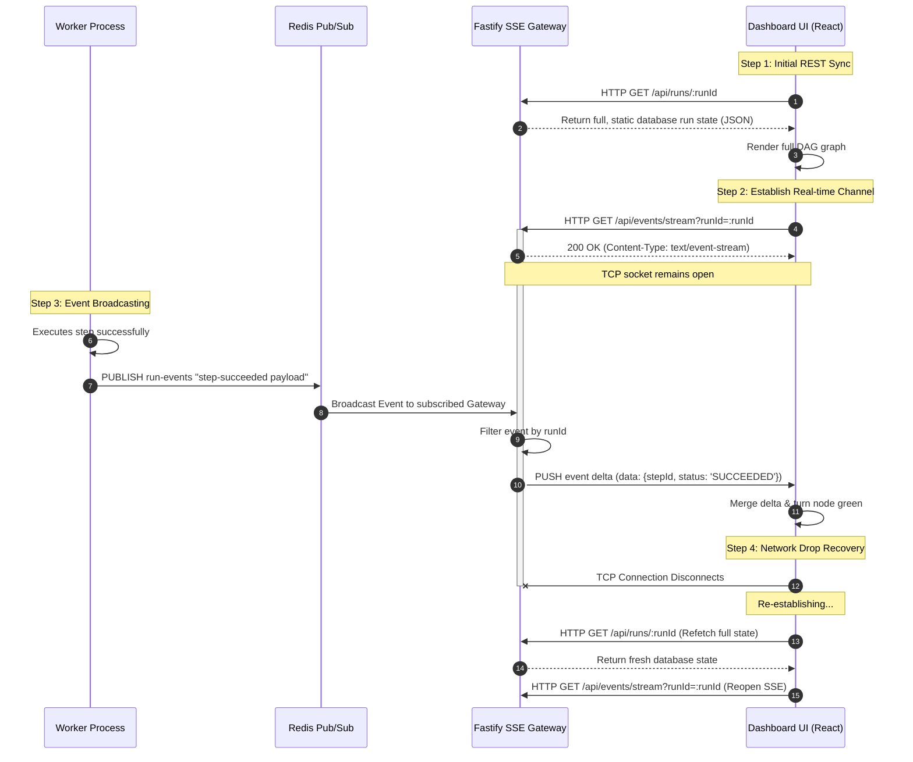

# Real-Time Update Service — Redis Pub/Sub & SSE Streaming

The **Real-Time Update Service** is responsible for keeping the FlowForge Dashboard UI synced with the background execution plane in real time. It uses a combination of **Redis Pub/Sub** and **Server-Sent Events (SSE)** to stream lightweight delta events to operators without overloading the primary PostgreSQL database.

---

## 1. Role & Responsibilities

For a beginner SDE, think of the Real-Time Update Service as a **live news broadcasting network**:
* Workers act as **reporters on the ground**, publishing events as they happen (**Event Creation**).
* Redis Pub/Sub acts as the **central broadcasting tower**, distributing events in-memory (**Event Routing**).
* The SSE Gateway acts as the **local cable provider**, streaming events down an open HTTP channel to each browser (**Event Delivery**).
* The Dashboard UI acts as the **TV set**, rendering the live graph as updates arrive (**UI Rendering**).

---

## 2. Real-Time Streaming Architecture

The flow of a status event moving from a background worker to a browser screen is illustrated below:



---

## 3. Core Architectural Mechanisms

### A. Redis Pub/Sub (In-Memory, Fire-and-Forget)

When a worker transitions a step's state, it publishes a compact JSON payload to Redis:

```typescript
const event = {
  workflowRunId: "9b1deb4d-3b7d-4bad-9bdd-2b0d7b3dcb6d",
  stepRunId: "5c2eeb4a-2b7d-4abc-9cdd-2b0d7b3dcb5c",
  stepKey: "openai-embedder",
  status: "RUNNING",
  attemptCount: 1,
  timestamp: new Date().toISOString()
};

await redisPublisher.publish("run-events", JSON.stringify(event));
```

#### Why Redis Pub/Sub?
* **Performance**: Redis operates entirely in memory. Publishing and subscribing takes less than a millisecond, and it can route hundreds of thousands of events per second with virtually zero CPU overhead.
* **Non-Durability is a Feature**: Redis Pub/Sub does not save messages to disk. If a client is not connected when an event is sent, the event is lost. **This is perfectly acceptable** because the database (PostgreSQL) is the absolute, durable source of truth. Redis is only used for transient "UI hints".

---

### B. Server-Sent Events (SSE) vs. WebSockets

Many developer projects default to **WebSockets** for real-time updates. FlowForge intentionally uses **Server-Sent Events (SSE)** instead because it is a much cleaner architectural fit.

| Architectural Dimension | Server-Sent Events (SSE) | WebSockets |
| :--- | :--- | :--- |
| **Direction** | Uni-directional (Server to Client only) | Bi-directional (Server <-> Client) |
| **Protocol** | Standard HTTP (`text/event-stream`) | Custom TCP Upgrade (`ws://`) |
| **Connection Recovery** | **Built-in natively** in browsers | Must be written manually in JS |
| **Firewall Friendliness** | Works over standard HTTP/S (Port 80/443) | Can be blocked by strict corporate firewalls |
| **Complexity** | Extremely simple to build and debug | High complexity (requires framing, heartbeat pings) |

#### How SSE Works:
1. The client opens a standard HTTP request with `Accept: text/event-stream`.
2. The server responds with `Content-Type: text/event-stream` and keeps the TCP connection open indefinitely (`Connection: keep-alive`).
3. Whenever an event is received from Redis, the server writes raw text formatted according to the SSE standard:
   ```text
   event: status-update
   data: {"stepKey": "openai-embedder", "status": "RUNNING"}
   
   ```
4. The browser's native `EventSource` API receives this string, parses it back into a JSON object, and fires a JavaScript callback.

---

### C. The Hybrid State Sync Pattern

In real-world networks, connections drop constantly (e.g. mobile device switching cell towers, laptop lids closing). If the SSE stream drops, the dashboard will miss critical state-change events, causing the UI graph to drift out of sync.

To solve this, FlowForge implements the **Hybrid State Sync Pattern**:

1. **Initial Hydration**: When the operator opens the dashboard, the page fetches the complete, absolute truth of the run from the database (`GET /api/runs/:runId`).
2. **Streaming Delta Merges**: The UI opens the SSE stream and listens for changes. When a delta arrives, it merges it into the local state:
   ```javascript
   // Inside React State Manager
   setRunState(prevState => {
     return {
       ...prevState,
       stepRuns: prevState.stepRuns.map(step => 
         step.stepKey === delta.stepKey 
           ? { ...step, status: delta.status } 
           : step
       )
     };
   });
   ```
3. **Reconnection Hydration**: If the SSE connection drops, the browser's `EventSource` triggers an error handler. The UI immediately triggers a full REST fetch (`GET /api/runs/:runId`) to sweep any state changes that happened while it was offline, before reopening the SSE stream. This guarantees **zero state drift** under any network conditions.
