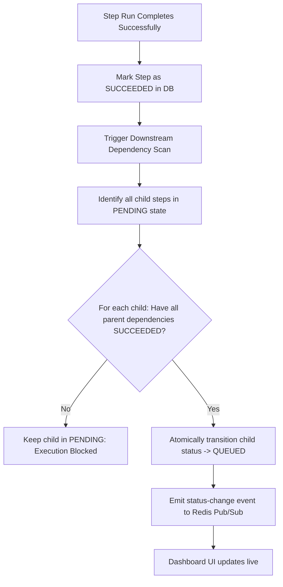
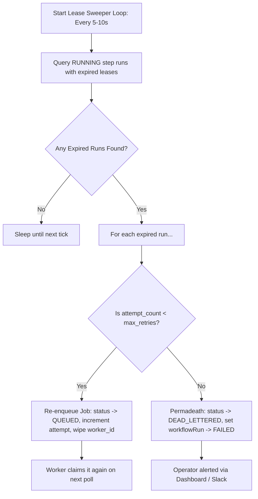

# Workflow Orchestration Engine — Dependency Scheduling & Lease Sweeping

The **Workflow Orchestration Engine** is the coordination brain of FlowForge. It operates quietly in the background, managing the state machine of the entire workflow execution, resolving dependency trees, and recovering from hardware or worker crashes.

---

## 1. Role & Responsibilities

For a beginner SDE, if the API Service is the bouncer, the **Orchestration Engine** is the **project manager**:
* It tracks which steps have completed and decides which steps are now ready to run (**Dependency Resolution**).
* It transitions steps from waiting (`PENDING`) to executable (`QUEUED`) atomically.
* It monitors the health of executing workers and salvages work when a worker crashes (**Lease Sweeping**).

---

## 2. DAG Execution Lifecycle

Below is the state transitions and dependency evaluation flow managed by the engine:



---

## 3. Core Architectural Mechanisms

### A. Atomic Dependency Resolution via Conditional SQL Updates

When multiple parent steps complete at the same time, we must avoid race conditions where downstream steps are queued multiple times or bypassed. FlowForge solves this with a **single, highly optimized atomic database query**.

Instead of pulling rows into application memory, evaluating them, and writing them back (which introduces timing gaps), we run a single query that updates the statuses in one step inside the database transaction:

```sql
UPDATE step_runs child
SET status = 'QUEUED',
    next_run_at = NOW()
WHERE child.workflow_run_id = :run_id
  AND child.status = 'PENDING'
  AND NOT EXISTS (
      -- Look for any dependency of this child that is NOT fully succeeded
      SELECT 1
      FROM step_dependencies dep
      JOIN step_runs parent
        ON parent.step_id = dep.depends_on_step_id
       AND parent.workflow_run_id = child.workflow_run_id
      WHERE dep.step_id = child.step_id
        AND parent.status != 'SUCCEEDED'
  );
```

#### Beginner SDE Breakdown of the Query:
1. **Target**: Update any `step_runs` belonging to the current workflow run (`run_id`) that are still waiting (`PENDING`).
2. **Safety Barrier (`NOT EXISTS`)**: The database looks at the child's dependencies. It joins `step_dependencies` (which defines which steps must run before another) with the actual `step_runs` of the parents.
3. **Trigger**: If it finds even a single parent that has a status other than `SUCCEEDED` (e.g., `RUNNING`, `QUEUED`, or `FAILED`), the `NOT EXISTS` condition fails, and the child step remains `PENDING`.
4. **Execution**: If all parents are indeed `SUCCEEDED`, the condition is met, and the database changes the child to `QUEUED` instantly. Since databases process writes serially and atomically at the row level, **this transition is immune to race conditions.**

---

### B. Worker Crash Recovery: The Lease Sweeper Daemon

In a distributed environment, servers crash, networks disconnect, and workers experience Out-of-Memory (OOM) errors. When a worker dies in the middle of executing a task, how do we make sure the job doesn't hang in `RUNNING` forever?

FlowForge implements a **Leasing Mechanism** coupled with a background **Lease Sweeper Daemon**.



#### How the Leases Work:
1. **Acquiring a Lease**: When a worker claims a step, it updates the database row and sets `lease_expires_at = NOW() + INTERVAL '30 seconds'`.
2. **Heartbeats**: As long as the worker is alive and executing the task, it sends a periodic **heartbeat** (every 10 seconds) that extends the lease by another 30 seconds.
3. **The Sweep**: The Orchestration Engine runs a lightweight background loop. It repeatedly queries the database for active tasks whose leases have expired:
   ```sql
   SELECT id, attempt_count, retry_policy
   FROM step_runs
   WHERE status = 'RUNNING'
     AND lease_expires_at < NOW();
   ```
4. **Recovery / Re-enqueuing**: 
   * If the task's current attempts are under the limit, the sweeper **reclaims** the job atomically, resetting its status back to `QUEUED` so a different, healthy worker can claim it:
     ```sql
     UPDATE step_runs
     SET status = 'QUEUED',
         worker_id = NULL,
         lease_expires_at = NULL,
         attempt_count = attempt_count + 1
     WHERE id = :step_run_id;
     ```
   * If attempts are exhausted, the job is moved to `DEAD_LETTERED`, halting execution safely and ensuring bad jobs (e.g. poison pills that crash workers instantly) do not loop forever and bring down the entire pool.
