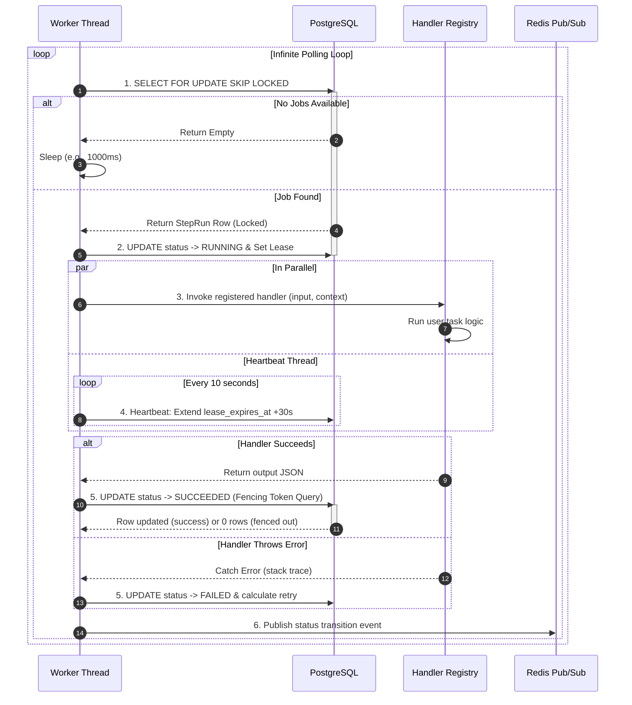

# Distributed Workers Plane — Concurrency-Safe Polling & Fencing

The **Distributed Workers Plane** is the heavy-lifting engine of FlowForge. It consists of multiple independent, horizontally scalable worker processes that claim jobs, run execution code via the **Handler Registry**, and safely persist results back to PostgreSQL.

---

## 1. Role & Responsibilities

For a beginner SDE, if the API is the bouncer and the engine is the project manager, the **Workers** are the **laborers**:
* They poll the database queue for executable work (**Job Polling**).
* They dynamically execute specific functions mapped to the step key (**Handler Invocation**).
* They report their status periodically so the system knows they are alive (**Heartbeating**).
* They write output results or errors back to the database in a concurrency-safe manner (**Fenced Writes**).

---

## 2. Worker Execution Pipeline

A worker process operates in an infinite loop, following this precise sequence of execution:



---

## 3. Core Architectural Mechanisms

### A. High-Throughput Queue Polling via `SKIP LOCKED`

In high-scale environments, having fifty workers polling the same database table concurrently would typically lead to severe database slowdowns or deadlocks due to row contention. If Worker 1 locks Row A, Worker 2 blocks and waits for Worker 1 to finish.

FlowForge eliminates this bottleneck using **row-level locks with skip options**:

```sql
SELECT id, step_id, input_payload, attempt_count
FROM step_runs
WHERE status = 'QUEUED'
  AND next_run_at <= NOW()
ORDER BY priority DESC, created_at ASC
FOR UPDATE SKIP LOCKED
LIMIT 1;
```

#### SDE Explanation of `FOR UPDATE SKIP LOCKED`:
1. **`FOR UPDATE`**: Instructs PostgreSQL to acquire an exclusive lock on the qualifying row so no other connection can update or lock it.
2. **`SKIP LOCKED`**: This is the magic ingredient. If a worker encounters a row that is **already locked** by another worker, instead of waiting (which causes latency and bottlenecks), **it immediately skips it** and evaluates the next row in the index.
3. **Outcome**: Under high concurrency, 50 workers can query the exact same table simultaneously, and each will instantly acquire a unique job without any lock waiting. The claim process scales linearly with the number of workers ($O(1)$ claiming complexity).

---

### B. Zombie Worker Mitigation via Fencing Tokens

One of the most complex bugs in distributed systems is the **Slow / Zombie Worker** problem.

#### The Zombie Worker Scenario:
1. **Worker A** claims a heavy document-processing task. Its lease is set to expire in 30 seconds.
2. **Worker A** experiences a massive garbage collection pause, or a major virtual machine freeze. It halts completely.
3. Because Worker A is frozen, it misses its heartbeat.
4. The **Lease Sweeper Daemon** observes that the lease has expired, assumes Worker A crashed, and re-queues the step.
5. **Worker B** claims the task, processes it successfully in 5 seconds, and writes the output to the database.
6. **Worker A wakes up!** It is unaware it was frozen. It completes the document processing and attempts to write its output back to the database.
7. **The Disaster**: Without guards, Worker A overwrites Worker B's fresh result with stale data, corrupting the workflow.

#### The Solution: Fencing Token Database Writes:
To prevent this, workers are strictly forbidden from writing results using a simple `UPDATE` query. They *must* verify their lease ownership at the exact moment of the commit transaction:

```sql
UPDATE step_runs
SET status = 'SUCCEEDED',
    output_payload = :output,
    completed_at = NOW()
WHERE id = :step_run_id
  AND worker_id = :worker_id
  AND lease_expires_at > NOW()
  AND status = 'RUNNING';
```

#### SDE Breakdown of the Fencing Check:
* If Worker A is a zombie, its `lease_expires_at` is now in the past (`lease_expires_at > NOW()` evaluates to `false`). Or, its status has been changed back to `QUEUED` or claimed by someone else (so `status = 'RUNNING'` evaluates to `false`).
* The database performs the query, matches `0` rows, and returns `Rows Affected: 0`.
* The worker detects that `0` rows were updated, realizes it has been fenced out, and safely **discards its stale output**, keeping the database clean.

---

### C. The Handler Registry & Idempotency

Workers maintain a static dictionary mapping strings to async functions:

```typescript
const registry: Record<string, StepHandler> = {
  "repo-indexer": async (ctx, input) => { /* ... */ },
  "openai-embedder": async (ctx, input) => { /* ... */ }
};
```

Because FlowForge guarantees **At-Least-Once execution** (jobs are re-run on worker crash), a task might run multiple times. Therefore, handlers must be designed to be **Idempotent** (running them twice has the same effect as running them once).

#### How SDEs Write Idempotent Handlers:
Each handler receives a unique `idempotency_key` via its context:
```text
idempotency_key = workflow_run_id + step_id + attempt_count
```
Before performing side effects (like charging a credit card or sending an email), the handler checks a transaction table:
1. *"Has this idempotency key already executed?"*
2. If **yes**, immediately skip execution and return the previously stored output.
3. If **no**, execute the side effect, record the key in the database, and proceed.
