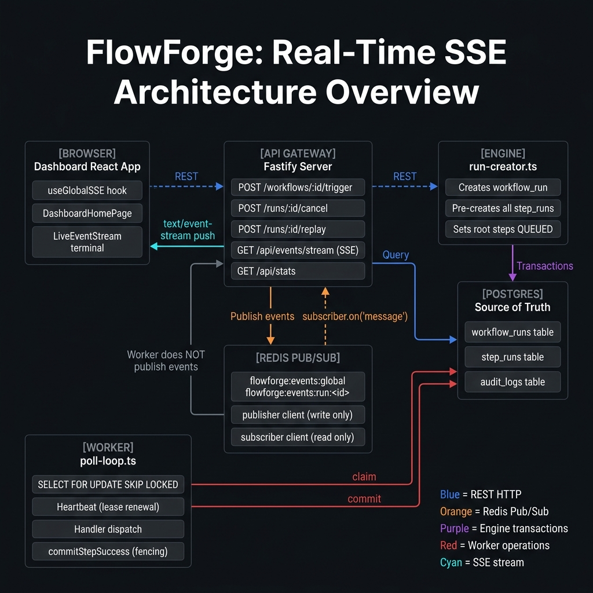
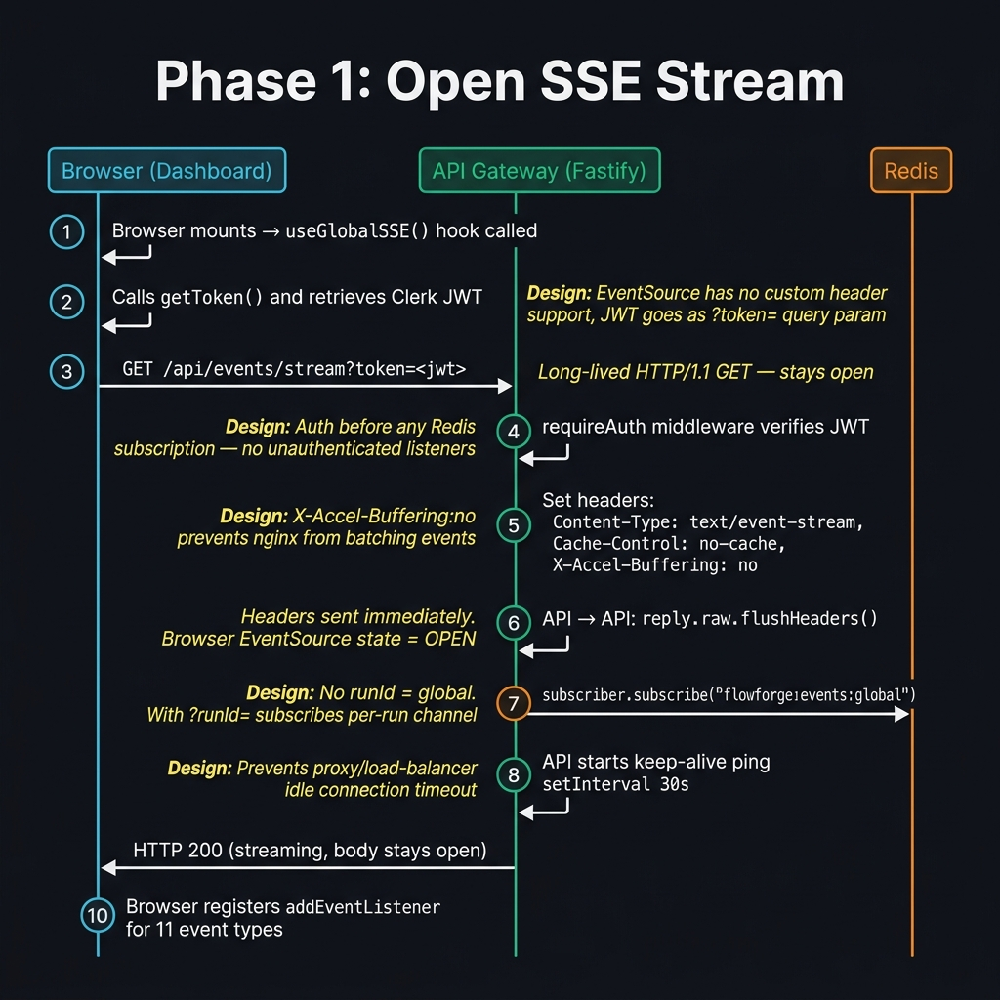
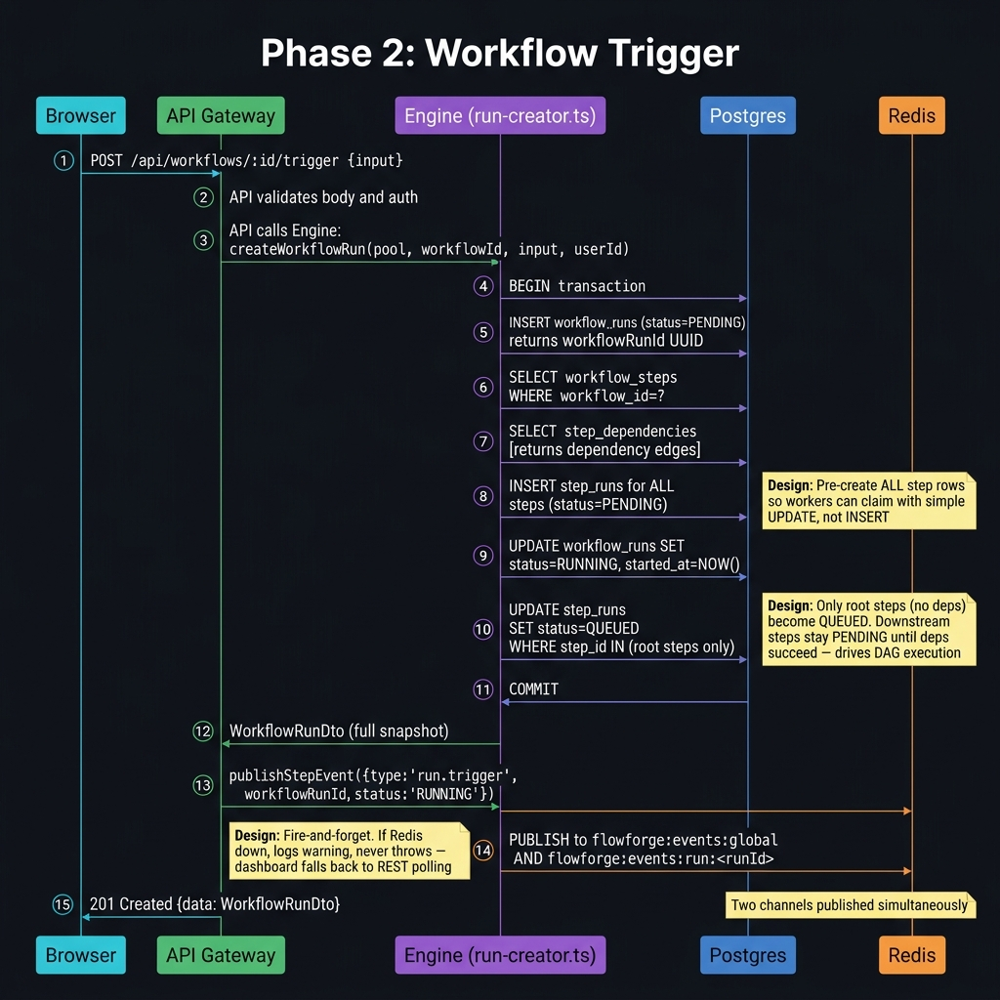
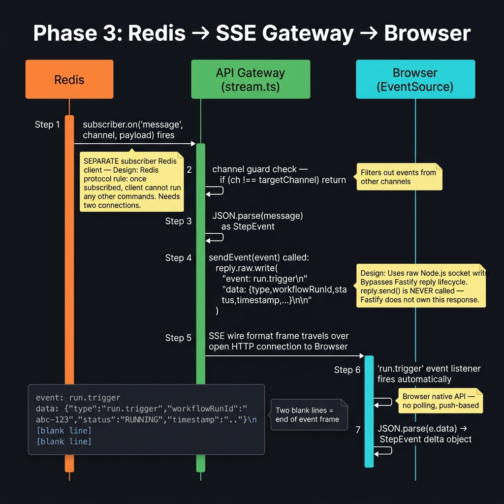
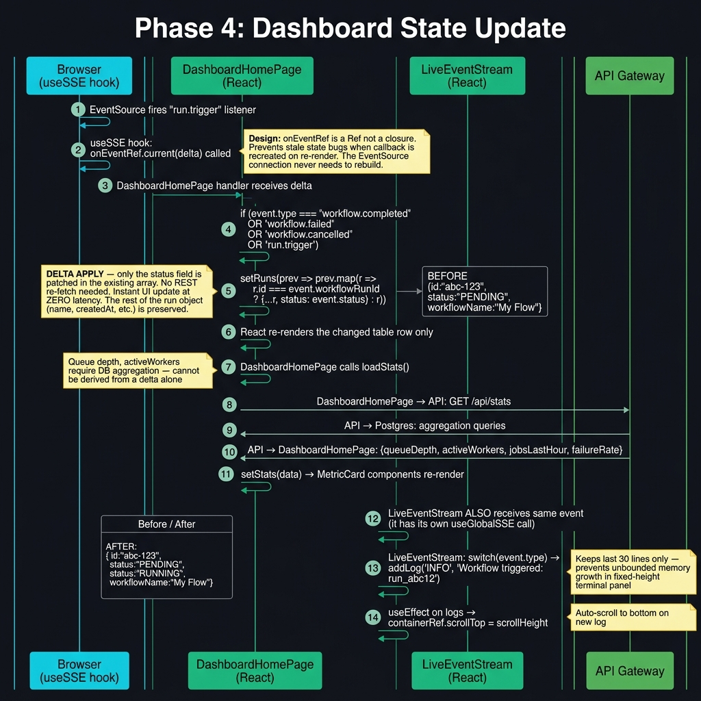
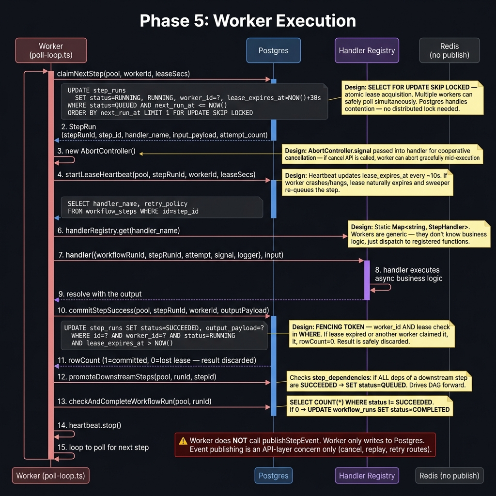
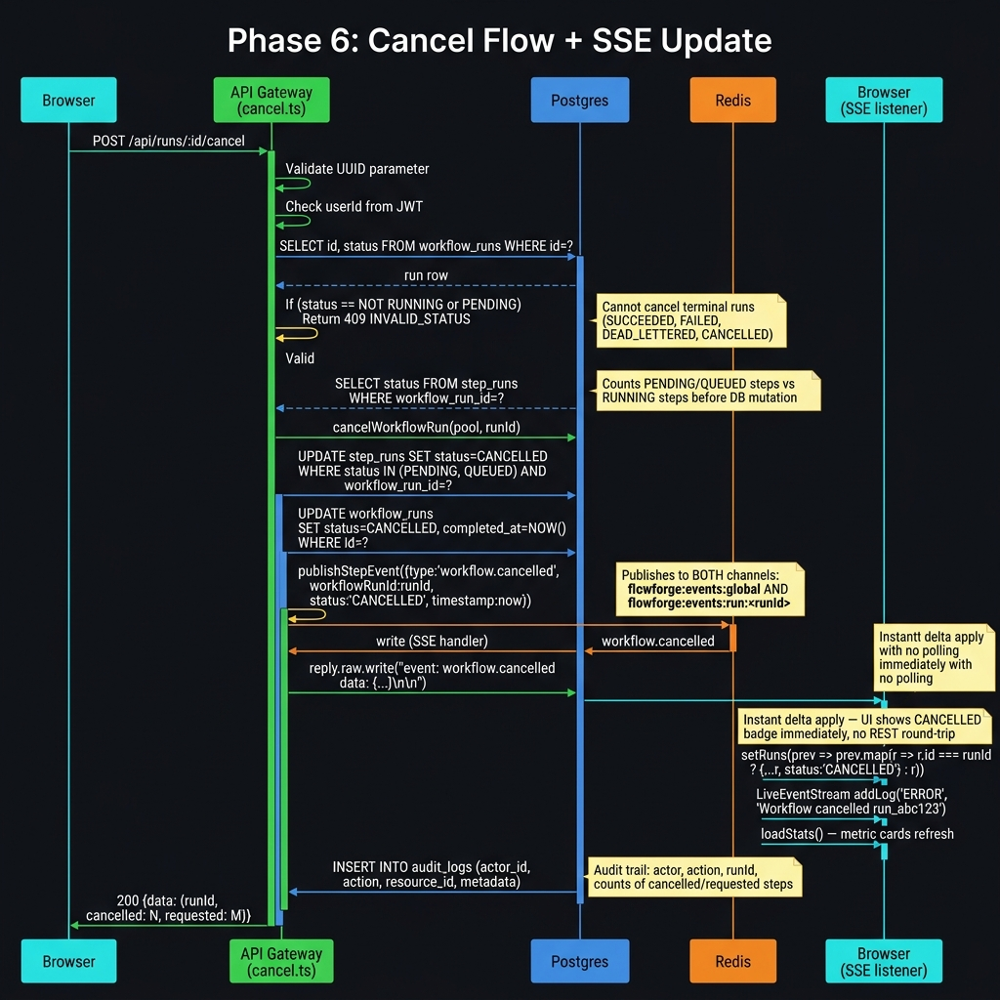
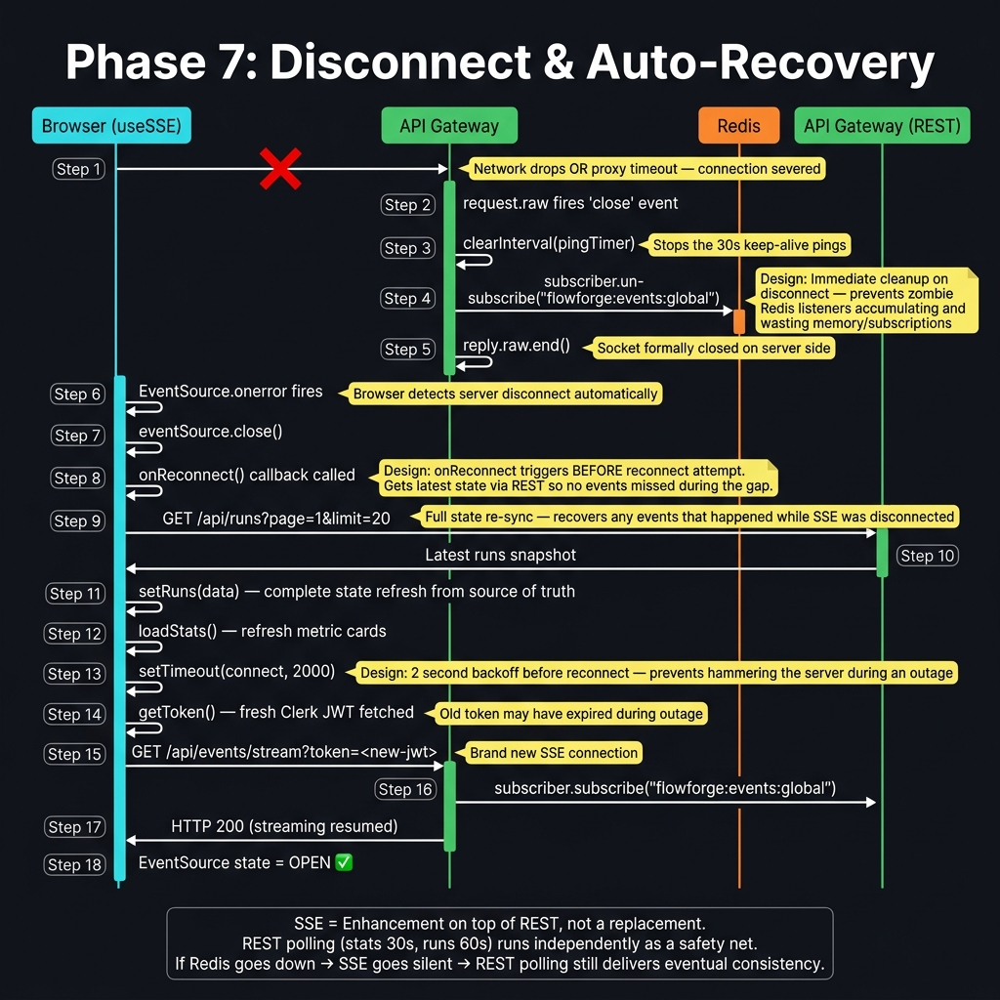

# FlowForge — Real-Time SSE + Redis Pub/Sub System Guide

> This guide explains how the **Server-Sent Events (SSE)** system works together with **Redis Pub/Sub**
> to deliver real-time updates to the FlowForge dashboard. It covers every phase of the pipeline
> with detailed sequence diagrams and the design decisions behind each choice.

---

## Table of Contents

1. [What is SSE?](#what-is-sse)
2. [What is a Delta (StepEvent)?](#what-is-a-delta-stepevent)
3. [Architecture Overview](#architecture-overview)
4. [Phase 1 — Opening the SSE Connection](#phase-1--opening-the-sse-connection)
5. [Phase 2 — Workflow Trigger](#phase-2--workflow-trigger)
6. [Phase 3 — Redis → SSE Gateway → Browser](#phase-3--redis--sse-gateway--browser)
7. [Phase 4 — Dashboard State Update](#phase-4--dashboard-state-update)
8. [Phase 5 — Worker Claims and Executes a Step](#phase-5--worker-claims-and-executes-a-step)
9. [Phase 6 — Cancel Flow with SSE Update](#phase-6--cancel-flow-with-sse-update)
10. [Phase 7 — Disconnect and Auto-Recovery](#phase-7--disconnect-and-auto-recovery)
11. [Redis Channel Design](#redis-channel-design)
12. [Resilience Design](#resilience-design)
13. [Design Decisions Summary](#design-decisions-summary)

---

## What is SSE?

**Server-Sent Events (SSE)** is a browser-native protocol where the **server pushes data to the
client over a single long-lived HTTP connection**. Unlike WebSockets (bi-directional), SSE is
one-way: **server → browser only**. This makes it simple, firewall-friendly, and perfect for
streaming live status updates.

### SSE Wire Format

Each event on the wire looks like this:

```
event: step.succeeded
data: {"type":"step.succeeded","workflowRunId":"abc-123","status":"SUCCEEDED","timestamp":"..."}

```

- The `event:` line is the **named event type** — the browser fires the corresponding listener.
- The `data:` line contains the **JSON payload** (the delta).
- **Two blank lines** (`\n\n`) terminate the event frame.
- The browser's native `EventSource` API parses this automatically — no libraries needed.

### Why SSE and not WebSockets?

| | SSE | WebSockets |
|---|---|---|
| Direction | Server → Client only | Bi-directional |
| Protocol | Plain HTTP/1.1 | Upgrade to WS |
| Firewall friendly | ✅ Yes | ❌ Sometimes blocked |
| Auto-reconnect | ✅ Built into browser | ❌ Must implement manually |
| Header auth | ❌ No custom headers | ✅ Yes |
| Use case fit | Read-only telemetry dashboard | Chat, games, collaborative editing |

FlowForge only needs **server → browser** (status updates). SSE is the simpler, more reliable choice.

---

## What is a Delta (StepEvent)?

> 📁 **Implemented in:**
> `flowforge/packages/shared/src/types.ts` — `StepEvent` type definition (lines 24–37)

A `StepEvent` is a **minimal change object** — it carries only what changed, not a full snapshot.
Defined in `flowforge/packages/shared/src/types.ts`:

```ts
type StepEvent = {
  type:          'step.queued' | 'step.started' | 'step.succeeded' |
                 'step.failed' | 'step.retrying' | 'step.dead_lettered' |
                 'step.cancelled' | 'workflow.completed' | 'workflow.failed' |
                 'workflow.cancelled';
  workflowRunId: string;   // which run this belongs to
  stepRunId?:    string;   // which step (absent on workflow-level events)
  stepId?:       string;
  status:        string;   // the NEW status value
  timestamp:     string;   // ISO 8601
  workerId?:     string;
  attempt?:      number;
  errorMessage?: string;
};
```

The dashboard applies the delta **surgically** onto existing React state:

```ts
// Only the status field is patched — no REST round-trip needed
setRuns(prev => prev.map(r =>
  r.id === event.workflowRunId
    ? { ...r, status: event.status }   // delta apply
    : r
));
```

---

## Architecture Overview

> 📁 **All packages involved:**
>
> | Package path | npm package name |
> |---|---|
> | `flowforge/packages/shared/` | `@flowforge/shared` |
> | `flowforge/packages/events/` | `@flowforge/events` |
> | `flowforge/packages/db/` | `@flowforge/db` |
> | `flowforge/packages/engine/` | `@flowforge/engine` |
> | `flowforge/packages/queue/` | `@flowforge/queue` |
> | `flowforge/packages/handlers/` | `@flowforge/handlers` |
> | `flowforge/packages/api/` | `@flowforge/api` |
> | `flowforge/packages/worker/` | `@flowforge/worker` |
> | `flowforge/packages/scheduler/` | `@flowforge/scheduler` |
> | `flowforge/packages/dashboard/` | `@flowforge/dashboard` |



### Actors

| Actor | Package | Role |
|---|---|---|
| **Browser** | `packages/dashboard` | React app, `useSSE` hook, `EventSource` |
| **API Gateway** | `packages/api` | Fastify server — SSE endpoint + all REST routes |
| **Engine** | `packages/engine` | Creates workflow runs and step runs in Postgres |
| **Postgres** | `packages/db` | Source of truth for all state |
| **Redis** | `packages/events` | Pub/Sub message broker |
| **Worker** | `packages/worker` | Claims steps, executes handlers, commits results |

### Redis Channel Architecture

| Channel Key | Subscribers | Purpose |
|---|---|---|
| `flowforge:events:global` | Dashboard home, `LiveEventStream` | All events from all runs |
| `flowforge:events:run:<runId>` | Run detail page | Events for one specific run only |

---

## Phase 1 — Opening the SSE Connection

> 📁 **Implemented in:**
>
> | File | What it does here |
> |---|---|
> | `flowforge/packages/dashboard/src/hooks/useSSE.ts` | `useSSE()` and `useGlobalSSE()` hooks — opens `EventSource`, registers all 11 listeners, handles `onerror` + reconnect |
> | `flowforge/packages/api/src/routes/events/stream.ts` | `eventStreamRoute` — sets SSE headers, flushes, creates Redis subscription, starts keep-alive ping |
> | `flowforge/packages/api/src/routes/events/index.ts` | Registers `GET /events/stream` route with `requireAuth` preHandler |
> | `flowforge/packages/api/src/middleware/auth.ts` | `requireAuth` — JWT verification before any subscription is created |
> | `flowforge/packages/events/src/subscribe.ts` | `subscribeToGlobalEvents()` / `subscribeToRunEvents()` — wraps Redis subscriber |
> | `flowforge/packages/events/src/redis-client.ts` | Exports `publisher` and `subscriber` ioredis instances |



### Step-by-Step

1. **Browser mounts** → `useGlobalSSE()` hook called on component mount.
2. **Get JWT** → `getToken()` from Clerk fetches the auth token asynchronously.
3. **Open connection** → `new EventSource('/api/events/stream?token=<jwt>')` — a long-lived HTTP GET.
4. **Auth middleware** → `requireAuth` verifies the JWT before any Redis subscription is created.
5. **Set headers** → Fastify sets `Content-Type: text/event-stream`, `Cache-Control: no-cache`,
   `Connection: keep-alive`, `X-Accel-Buffering: no`.
6. **Flush headers** → `reply.raw.flushHeaders()` sends headers immediately. Browser `EventSource` state = `OPEN`.
7. **Redis subscribe** → `subscriber.subscribe("flowforge:events:global")` — the connection is now live.
8. **Keep-alive timer** → `setInterval(ping, 30_000)` — sends SSE comment `: ping\n\n` every 30 seconds.
9. **Register listeners** → Browser registers `addEventListener` for all 11 event types.

### Design Decisions

| Decision | Rationale |
|---|---|
| JWT as `?token=` query param | `EventSource` API has **no custom header support** in browsers |
| `X-Accel-Buffering: no` | Prevents nginx from batch-buffering events, ensuring real-time delivery |
| `reply.raw.flushHeaders()` immediately | Browser must receive headers to know the stream is open |
| Keep-alive ping every 30s | Most proxies/load balancers close idle connections after ~60s |
| `useRef` for `onEvent` callback | Prevents callback identity changes from tearing down the connection |

---

## Phase 2 — Workflow Trigger

> 📁 **Implemented in:**
>
> | File | What it does here |
> |---|---|
> | `flowforge/packages/api/src/routes/workflows/` | Trigger route — validates body, calls `createWorkflowRun`, publishes `run.trigger` event |
> | `flowforge/packages/engine/src/run-creator.ts` | `createWorkflowRun()` — single Postgres transaction: inserts workflow_run + all step_runs, promotes root steps to QUEUED |
> | `flowforge/packages/engine/src/step-pre-creator.ts` | `preCreateStepRuns()` — bulk-inserts all step_run rows as PENDING |
> | `flowforge/packages/engine/src/dag-validator.ts` | Validates the DAG (no cycles, all deps exist) before trigger is accepted |
> | `flowforge/packages/events/src/publish.ts` | `publishStepEvent()` — publishes `run.trigger` to both Redis channels |
> | `flowforge/packages/events/src/channels.ts` | `CHANNEL_GLOBAL` constant + `runChannel(runId)` builder |



### Step-by-Step

1. **Browser** → `POST /api/workflows/:id/trigger { input }`.
2. **API validates** body schema and auth identity.
3. **Engine called** → `createWorkflowRun(pool, workflowId, input, userId)`.
4. **Postgres transaction begins** → `BEGIN`.
5. **INSERT workflow_run** with `status = PENDING` → returns `workflowRunId` UUID.
6. **Fetch step definitions** → `SELECT workflow_steps WHERE workflow_id = ?`.
7. **Fetch dependencies** → `SELECT step_dependencies WHERE workflow_id = ?`.
8. **Pre-create all step_runs** → `INSERT step_runs` for every step, all `status = PENDING`.
9. **Promote workflow** → `UPDATE workflow_runs SET status = RUNNING`.
10. **Promote root steps** → `UPDATE step_runs SET status = QUEUED WHERE step_id IN (root steps)`.
11. **COMMIT** transaction.
12. **Publish event** → `publishStepEvent({ type: 'run.trigger', ... })` to both Redis channels.
13. **Response** → `201 { data: WorkflowRunDto }` back to browser.

### Design Decisions

| Decision | Rationale |
|---|---|
| Single Postgres transaction | Atomicity — either the whole run is created or nothing is |
| Pre-create ALL step rows as PENDING | Workers can claim with a simple `UPDATE WHERE` — no `INSERT` at claim time, no race conditions |
| Only root steps become QUEUED | DAG execution — downstream steps wait for their dependencies to succeed before being promoted |
| `publishStepEvent` is fire-and-forget | Redis failure must never crash the API — dashboard falls back to REST polling |

---

## Phase 3 — Redis → SSE Gateway → Browser

> 📁 **Implemented in:**
>
> | File | What it does here |
> |---|---|
> | `flowforge/packages/events/src/subscribe.ts` | `subscribeToGlobalEvents(callback)` — attaches `subscriber.on('message', ...)` handler, filters by channel, parses JSON, calls `callback(event)` |
> | `flowforge/packages/events/src/redis-client.ts` | `subscriber` client — dedicated ioredis connection in subscribe-only mode |
> | `flowforge/packages/api/src/routes/events/stream.ts` | `sendEvent(event)` — writes `event: <type>\ndata: <json>\n\n` to `reply.raw`; `unsubscribe` cleanup on `request.raw` `'close'` |



### Step-by-Step

1. **Redis delivers** → `subscriber.on('message', channel, payload)` fires on the API process.
2. **Channel guard** → `if (ch !== targetChannel) return` — filters noise from other channels.
3. **Parse payload** → `JSON.parse(message) as StepEvent`.
4. **`sendEvent()` called** → writes to the raw socket:
   ```
   event: run.trigger\n
   data: {"type":"run.trigger","workflowRunId":"abc-123",...}\n
   \n
   ```
5. **SSE frame** travels over the open HTTP connection to the browser.
6. **`EventSource` fires** the named event listener (`'run.trigger'`) automatically.
7. **Browser parses** `JSON.parse(e.data)` → `StepEvent` delta object.

### Why Two Redis Clients?

```
publisher  → can only PUBLISH
subscriber → can only SUBSCRIBE / receive messages
```

Redis protocol rule: once a client enters subscription mode (`SUBSCRIBE`), it **cannot issue any
other commands**. Two dedicated connections are mandatory.

### Design Decisions

| Decision | Rationale |
|---|---|
| Two separate Redis clients | Redis protocol: subscribed client cannot run other commands |
| Write to `reply.raw` (raw Node socket) | Bypasses Fastify's normal request/reply lifecycle |
| `reply.send()` is never called | Fastify must not close the response — we control the socket manually |
| Named SSE events (`event:` line) | Browser `addEventListener('step.succeeded', ...)` — no type-switch needed in JS |

---

## Phase 4 — Dashboard State Update

> 📁 **Implemented in:**
>
> | File | What it does here |
> |---|---|
> | `flowforge/packages/dashboard/src/hooks/useSSE.ts` | `useSSE()` — `onEventRef.current(delta)` dispatch, `useRef` pattern to avoid stale closures |
> | `flowforge/packages/dashboard/src/pages/DashboardHomePage.tsx` | `useGlobalSSE` handler (lines 70–87) — delta apply on `setRuns`, calls `loadStats()` on workflow-level events |
> | `flowforge/packages/dashboard/src/components/dashboard/LiveEventStream.tsx` | Independent `useGlobalSSE` subscriber — `addLog()`, 30-line ring buffer, auto-scroll via `useEffect` |
> | `flowforge/packages/dashboard/src/api/stats.ts` | `getStats(token)` — REST call to `/api/stats` for metric card refresh |
> | `flowforge/packages/dashboard/src/api/runs.ts` | `getRuns(token, ...)` — REST call to `/api/runs` for full run list refresh on reconnect |
> | `flowforge/packages/api/src/routes/stats.ts` | `/api/stats` endpoint — aggregates queue depth, active workers, jobs last hour, failure rate from Postgres |



### Step-by-Step

1. **EventSource** fires the `'run.trigger'` listener.
2. **`useSSE` hook** calls `onEventRef.current(delta)`.
3. **`DashboardHomePage`** handler checks `event.type`.
4. **Delta apply** → only `status` is patched onto the existing row in state:
   ```ts
   setRuns(prev => prev.map(r =>
     r.id === event.workflowRunId ? { ...r, status: event.status } : r
   ));
   ```
5. **React re-renders** only the changed table row.
6. **`loadStats()`** is called via REST to refresh metric cards.
7. **`LiveEventStream`** (independent subscription) converts the event to a terminal log line.
8. **Auto-scroll** → `containerRef.scrollTop = scrollHeight` after every new log entry.

### Before / After Delta Apply

```
BEFORE:  { id: "abc-123", status: "PENDING", workflowName: "My Flow", createdAt: "..." }
AFTER:   { id: "abc-123", status: "RUNNING", workflowName: "My Flow", createdAt: "..." }
                                    ^^^^^^^
                                only this field changed
```

### Design Decisions

| Decision | Rationale |
|---|---|
| Delta apply instead of REST re-fetch | Instant UI update at zero latency — no round-trip to API |
| `onEventRef` is a `useRef` | Avoids stale closure bugs when the callback is recreated on re-render |
| `loadStats()` still uses REST | Queue depth, active workers require DB aggregation — a delta cannot express these |
| `LiveEventStream` has its own `useGlobalSSE` | Decoupled from `DashboardHomePage` — independent subscription, independent log state |
| Last 30 lines only | Fixed-height terminal panel — unbounded log growth degrades performance |

---

## Phase 5 — Worker Claims and Executes a Step

> 📁 **Implemented in:**
>
> | File | What it does here |
> |---|---|
> | `flowforge/packages/worker/src/poll-loop.ts` | `pollLoop()` — main while loop: claim → heartbeat → handler dispatch → commit success/failure → promote downstream |
> | `flowforge/packages/queue/src/claim.ts` | `claimNextStep()` — `SELECT FOR UPDATE SKIP LOCKED` atomic claim SQL |
> | `flowforge/packages/queue/src/commit.ts` | `commitStepSuccess()` + `commitStepFailure()` — fencing token WHERE clause, retry policy, dead-letter logic |
> | `flowforge/packages/queue/src/promote.ts` | `promoteDownstreamSteps()` — checks `step_dependencies`, promotes newly-unblocked steps to QUEUED |
> | `flowforge/packages/queue/src/sweeper.ts` | Sweeper — re-queues steps whose `lease_expires_at < NOW()` (crashed workers) |
> | `flowforge/packages/worker/src/lease-heartbeat.ts` | `startLeaseHeartbeat()` — updates `lease_expires_at` on an interval |
> | `flowforge/packages/handlers/` | `handlerRegistry` — `Map<string, StepHandler>` of all registered business-logic handlers |



### Step-by-Step

1. **Claim** → `claimNextStep(pool, workerId, leaseSecs)`:
   ```sql
   UPDATE step_runs
   SET status = 'RUNNING', worker_id = ?, lease_expires_at = NOW() + 30s
   WHERE status = 'QUEUED' AND next_run_at <= NOW()
   ORDER BY next_run_at ASC
   LIMIT 1
   FOR UPDATE SKIP LOCKED
   RETURNING *;
   ```
2. **AbortController** created — signal passed into the handler for cooperative cancellation.
3. **Lease heartbeat started** — updates `lease_expires_at` every ~10 seconds.
4. **Fetch step definition** → `SELECT handler_name, retry_policy FROM workflow_steps WHERE id = ?`.
5. **Resolve handler** → `handlerRegistry.get(handler_name)`.
6. **Execute handler** → `handler({ workflowRunId, stepRunId, attempt, signal, logger }, input)`.
7. **Commit success** → `commitStepSuccess(pool, stepRunId, workerId, outputPayload)`:
   ```sql
   UPDATE step_runs SET status = 'SUCCEEDED', output_payload = ?
   WHERE id = ? AND worker_id = ? AND status = 'RUNNING' AND lease_expires_at > NOW();
   ```
8. **Check rowCount** → `0` means lease was lost — result discarded safely.
9. **Promote downstream** → `promoteDownstreamSteps(pool, runId, stepId)` advances DAG.
10. **Check completion** → `checkAndCompleteWorkflowRun(pool, runId)` — if all steps succeeded, mark `COMPLETED`.
11. **Heartbeat stopped**, AbortController removed.
12. **Loop back** to poll for next step.

> **⚠️ Important:** The worker does **NOT** call `publishStepEvent`. The worker only writes to
> Postgres. Event publishing is an API-layer concern (cancel, replay, retry routes only).

### Design Decisions

| Decision | Rationale |
|---|---|
| `SELECT FOR UPDATE SKIP LOCKED` | Atomic lease — multiple workers poll simultaneously without conflicts. Postgres handles contention, no distributed lock needed |
| Lease heartbeat | If worker crashes, lease expires naturally. The sweeper re-queues the step |
| Fencing token on commit | `WHERE worker_id = ? AND lease_expires_at > NOW()` — if lease expired, `rowCount = 0`, result discarded |
| `AbortController.signal` | Cooperative cancellation — handlers can check `signal.aborted` to stop work early |
| Static handler registry | Workers are generic dispatchers — business logic stays in registered handler functions |

---

## Phase 6 — Cancel Flow with SSE Update

> 📁 **Implemented in:**
>
> | File | What it does here |
> |---|---|
> | `flowforge/packages/api/src/routes/runs/cancel.ts` | `cancelRoute` — status guard (409), step count query, calls `cancelWorkflowRun`, publishes `workflow.cancelled`, inserts audit log |
> | `flowforge/packages/engine/src/cancel.ts` | `cancelWorkflowRun()` — bulk-cancels PENDING/QUEUED step_runs and marks workflow_run as CANCELLED |
> | `flowforge/packages/events/src/publish.ts` | `publishStepEvent({ type: 'workflow.cancelled', ... })` — fires to both Redis channels |
> | `flowforge/packages/dashboard/src/pages/DashboardHomePage.tsx` | Receives `workflow.cancelled` via SSE → delta apply → instant CANCELLED badge |



### Step-by-Step

1. **Browser** → `POST /api/runs/:id/cancel`.
2. **Auth check** → `userId` extracted from JWT.
3. **Status check** → `SELECT status FROM workflow_runs WHERE id = ?`.
4. **409 guard** → if already terminal (`SUCCEEDED`, `FAILED`, etc.) return `409 INVALID_STATUS`.
5. **Count steps** → query step statuses before DB mutation (for accurate audit log).
6. **Cancel in DB** → `cancelWorkflowRun(pool, runId)`:
   - `UPDATE step_runs SET status = 'CANCELLED' WHERE status IN ('PENDING', 'QUEUED')`
   - `UPDATE workflow_runs SET status = 'CANCELLED', completed_at = NOW()`
7. **Publish event** → `publishStepEvent({ type: 'workflow.cancelled', ... })` — both channels.
8. **Redis delivers** to the subscriber on the same Fastify process.
9. **SSE frame sent** → `event: workflow.cancelled\ndata: {...}\n\n`.
10. **Dashboard updates** → `status: 'CANCELLED'` badge appears **before** the REST 200 returns.
11. **Audit log** → `INSERT INTO audit_logs (actor_id, 'run.cancel', runId, { cancelled, requested })`.
12. **Response** → `200 { data: { runId, cancelled, requested } }`.

### Design Decisions

| Decision | Rationale |
|---|---|
| 409 for terminal runs | Idempotency — prevents double-cancel, clear error message |
| Step counts computed before mutation | Accurate audit metadata — after mutation all statuses are CANCELLED |
| Same process receives its own publish | The Fastify process has both publisher and subscriber clients — it publishes and receives via local Redis loopback |
| UI updates before REST response | SSE arrives before HTTP response completes — gives instant feedback |

---

## Phase 7 — Disconnect and Auto-Recovery

> 📁 **Implemented in:**
>
> | File | What it does here |
> |---|---|
> | `flowforge/packages/api/src/routes/events/stream.ts` | `request.raw.on('close', ...)` — `clearInterval`, `unsubscribe()`, `reply.raw.end()` cleanup on disconnect |
> | `flowforge/packages/dashboard/src/hooks/useSSE.ts` | `eventSource.onerror` handler — calls `onReconnect()`, then `setTimeout(connect, 2000)`; cleanup in `useEffect` return |
> | `flowforge/packages/dashboard/src/pages/DashboardHomePage.tsx` | `onReconnect` callback passed to `useGlobalSSE` — calls `loadStats()` + `loadRuns(false)` for full REST re-sync |



### Step-by-Step

**Server side (on disconnect):**
1. Network drops or proxy timeout — connection severed.
2. `request.raw` fires `'close'` event on the Fastify handler.
3. `clearInterval(pingTimer)` — ping timer stops.
4. `subscriber.unsubscribe("flowforge:events:global")` — Redis listener removed immediately.
5. `reply.raw.end()` — socket formally closed.

**Browser side (recovery):**
6. `EventSource.onerror` fires.
7. `eventSource.close()` — old connection discarded.
8. `onReconnect()` callback called **first** — triggers REST re-sync before reconnecting.
9. `GET /api/runs` — full state snapshot fetched from REST.
10. `setRuns(data)` — complete state refresh from source of truth.
11. `loadStats()` — metric cards also refreshed.
12. `setTimeout(connect, 2000)` — 2 second backoff.
13. `getToken()` — fresh JWT fetched (old one may have expired).
14. `new EventSource('/api/events/stream?token=<new-jwt>')` — reconnect.
15. `subscriber.subscribe(...)` on server — stream resumes.

### Design Decisions

| Decision | Rationale |
|---|---|
| Immediate Redis unsubscribe on close | Prevents zombie Redis listeners accumulating — each open browser tab creates one subscriber |
| `onReconnect` before SSE reconnect | Fills the gap — any events that fired during the outage are recovered via REST |
| 2 second reconnect backoff | Prevents thundering herd during API restarts — if 1000 dashboards reconnect at once, 2s stagger helps |
| Fresh JWT on every reconnect | Clerk tokens have expiry — must re-fetch rather than reuse the cached one |
| REST polling runs independently | SSE is an **enhancement** on top of REST. Stats poll every 30s, runs every 60s — always running regardless of SSE state |

---

## Redis Channel Design

> 📁 **Implemented in:**
> - `flowforge/packages/events/src/channels.ts` — `CHANNEL_GLOBAL` constant + `runChannel(runId)` function
> - `flowforge/packages/events/src/publish.ts` — dual publish to both channels in `publishStepEvent()`
> - `flowforge/packages/events/src/subscribe.ts` — `subscribeToGlobalEvents()` and `subscribeToRunEvents()`
> - `flowforge/packages/events/src/redis-client.ts` — two separate ioredis connections (`publisher` + `subscriber`)

```
flowforge:events:global          flowforge:events:run:<runId>
        │                                    │
        │  All events from all runs          │  Events for ONE specific run
        │                                    │
        ▼                                    ▼
  DashboardHomePage               Run detail page (if built)
  LiveEventStream panel           Per-run SSE subscription
  (via useGlobalSSE)              (via useSSE(runId, ...))
```

Every `publishStepEvent()` call publishes to **both channels simultaneously**:

```ts
await publisher.publish(runChannel(event.workflowRunId), payload);  // per-run
await publisher.publish(CHANNEL_GLOBAL, payload);                    // global
```

This means the dashboard home page never needs to know which run is being watched — it gets
everything and filters in-browser.

---

## Resilience Design

> 📁 **Implemented in:**
> - **Redis failure** → `flowforge/packages/events/src/publish.ts` — `try/catch` around `publisher.publish()`, `logger.warn()`, never rethrows
> - **Fallback polling** → `flowforge/packages/dashboard/src/pages/DashboardHomePage.tsx` — `setInterval(loadStats, 30_000)` + `setInterval(loadRuns, 60_000)`
> - **Worker crash recovery** → `flowforge/packages/queue/src/sweeper.ts` — periodic query for expired leases, re-queues steps
> - **Heartbeat** → `flowforge/packages/worker/src/lease-heartbeat.ts` — keeps lease alive while worker is running

### What happens if Redis goes down?

```
publishStepEvent(event)
  └─► publisher.publish(...)
        └─► FAILS
              └─► catch(err) { logger.warn(err) }
                  return;   ← silent degradation, never throws

Dashboard behaviour:
  - SSE stream goes silent (no new push events)
  - REST polling still runs:
      Stats refresh every 30 seconds
      Runs list refresh every 60 seconds
  - On next SSE reconnect attempt:
      onerror fires → onReconnect() → full REST re-sync
```

### What happens if a Worker crashes mid-execution?

```
Worker dies mid-handler
  └─► No heartbeat update → lease_expires_at passes NOW()
  └─► Sweeper (scheduled job) runs
        └─► SELECT step_runs WHERE status=RUNNING AND lease_expires_at < NOW()
        └─► UPDATE step_runs SET status=QUEUED, next_run_at=NOW(), worker_id=NULL
        └─► Step is re-queued → another worker claims it
```

---

## Design Decisions Summary

| # | Decision | Rationale |
|---|---|---|
| D1 | Two Redis clients (publisher + subscriber) | Redis protocol: subscribed client cannot run other commands |
| D2 | `publishStepEvent` never throws | Dashboard is read-only telemetry — losing an event is acceptable, crashing the API is not |
| D3 | JWT as `?token=` query param | `EventSource` API has no custom header support |
| D4 | `X-Accel-Buffering: no` header | Prevents nginx from batching events and adding latency |
| D5 | Keep-alive ping every 30s | Proxy/load-balancer idle timeouts are typically 60s |
| D6 | Delta apply in React state | Avoids a full REST re-fetch on every event — instant update at zero latency |
| D7 | `onReconnect` triggers REST re-sync before reconnect | SSE is delivery-guaranteed-per-session only — REST fills the gap |
| D8 | `useRef` for `onEvent` callback | Prevents `useEffect` connection from rebuilding on every render |
| D9 | Two Redis channels (global + per-run) | Dashboard needs all events; run detail needs one — avoids filtering noise in-browser |
| D10 | Worker does NOT call `publishStepEvent` | Worker only touches Postgres — publishing is an API-layer concern |
| D11 | `SELECT FOR UPDATE SKIP LOCKED` for step claiming | Atomic lease — no distributed locks, Postgres handles contention |
| D12 | Lease heartbeat + fencing token on commit | Prevents stale worker committing results after lease expired |
| D13 | Root-only steps start as QUEUED | DAG fan-out driven by `promoteDownstreamSteps` — no polling for dependency resolution |
| D14 | Pre-create all step rows on trigger | All step rows exist from the start — workers claim with `UPDATE WHERE`, not `INSERT` |
| D15 | `LiveEventStream` keeps only last 30 lines | Fixed-height panel — unbounded growth degrades browser performance |

---

## Files Reference

| File | Package | Purpose |
|---|---|---|
| [`channels.ts`](../../flowforge/packages/events/src/channels.ts) | `@flowforge/events` | Redis channel key constants and builders |
| [`publish.ts`](../../flowforge/packages/events/src/publish.ts) | `@flowforge/events` | `publishStepEvent()` — fire-and-forget Redis PUBLISH |
| [`subscribe.ts`](../../flowforge/packages/events/src/subscribe.ts) | `@flowforge/events` | `subscribeToRunEvents()` / `subscribeToGlobalEvents()` |
| [`redis-client.ts`](../../flowforge/packages/events/src/redis-client.ts) | `@flowforge/events` | Two ioredis clients (publisher + subscriber) |
| [`stream.ts`](../../flowforge/packages/api/src/routes/events/stream.ts) | `@flowforge/api` | Fastify SSE handler — bridges Redis to browser |
| [`useSSE.ts`](../../flowforge/packages/dashboard/src/hooks/useSSE.ts) | `@flowforge/dashboard` | React hook — opens and manages the `EventSource` |
| [`LiveEventStream.tsx`](../../flowforge/packages/dashboard/src/components/dashboard/LiveEventStream.tsx) | `@flowforge/dashboard` | Terminal log panel — displays incoming SSE events |
| [`DashboardHomePage.tsx`](../../flowforge/packages/dashboard/src/pages/DashboardHomePage.tsx) | `@flowforge/dashboard` | Main dashboard — delta apply + stats refresh |
| [`poll-loop.ts`](../../flowforge/packages/worker/src/poll-loop.ts) | `@flowforge/worker` | Worker claim loop — SKIP LOCKED, heartbeat, fencing |
| [`types.ts`](../../flowforge/packages/shared/src/types.ts) | `@flowforge/shared` | `StepEvent` type definition |
